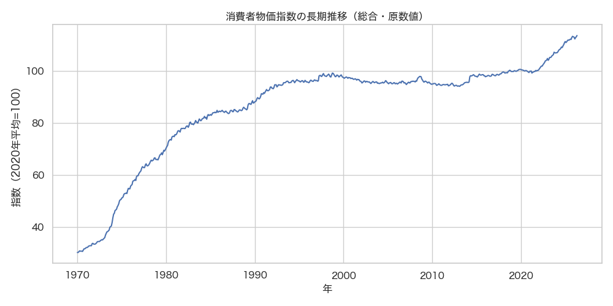
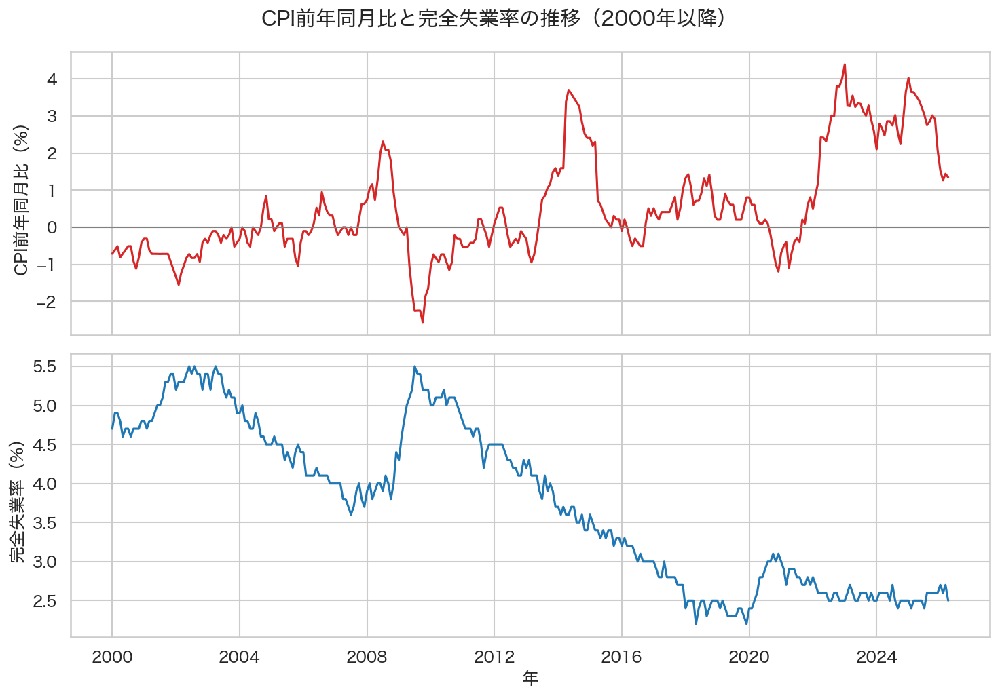
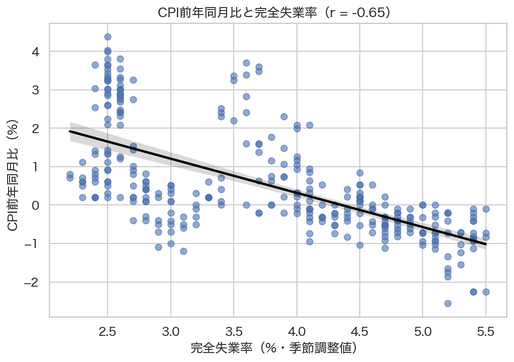
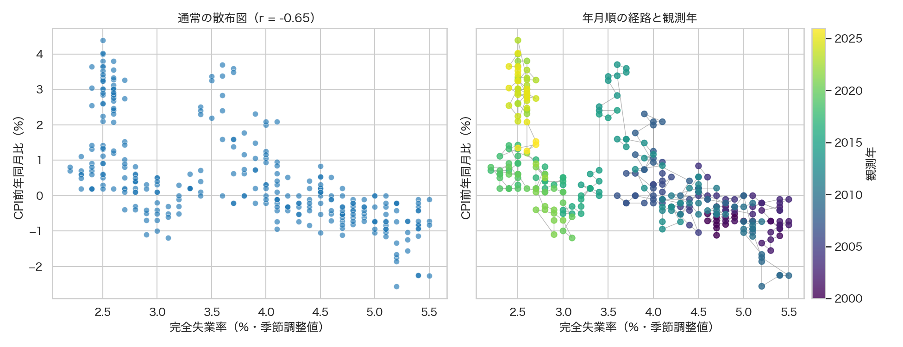

# 第11回　時系列データ解析（経済データ）

### 前回の復習

第10回は対象の関係を可視化する方法としてネットワークを活用した．
特に，都道府県間の人口移動を可視化した．

| 観点 | 第10回に行ったこと |
| --- | --- |
| 分析対象 | 都道府県間の人口移動 |
| データの形 | エッジリスト形式 (long format) |
| 構造 | ノード，エッジ，向き，重み |
| 可視化 | ネットワーク図 |
| 分析 | 重み付き次数，コミュニティ検出 |

今回は**時間的な順序**のあるデータ（時系列データ）を扱う．

### 今回の位置づけ

時系列データの代表例として，物価・賃金・為替・株価・消費などといった経済データを扱う．
**時系列データ**の解析方法として，長期的な変化・周期的な変動・短期的な変化とを区別して考えることがある．

使用するオープンデータは総務省統計局の**消費者物価指数** (CPI: Consumer Price Index)を使う．
統計ダッシュボードAPIから月次データを取得し，長期推移・2015年以降の推移・前年同月比を可視化する．
さらに，配布された完全失業率のCSVを読み込み，2つの時系列データの相関を調べる．

```{tip} データ分析の肝
ある１種類のデータを取得して分析するだけで面白い結果が得られることは稀である．
新しい知見を得るための一つの主要な手段として，２種類以上のデータを可視化して比較することが挙げられる．

※ 最終レポートでは２種類以上のオープンデータを取得して可視化まで行い，一見関係なさそうな対象の間に何らかの関係を見出すことを試みてもらう．
（レポートの詳細は次回アナウンスする）
```

### 到達目標

- 時系列データの特徴を説明する
- 時間を表す列を日付型に変換し，時間順に並べる
- トレンド，季節性，ノイズを区別する
- ラグ，差分，移動平均，前年同月比を計算する
- 指数データの基準年を確認して解釈する
- 原数値と季節調整値を目的に応じて使い分ける
- 2つの時系列データを年月で対応付け，相関係数を計算する
- 擬似相関と因果関係に注意して結果を解釈する
- 時系列グラフから読み取れることと注意点を説明する

**今回の流れ**

| 段階 | 内容 | 目的 |
| --- | --- | --- |
| 1 | 時系列データの基本概念を学ぶ | 時間順序と変動の構造を理解する |
| 2 | CPIと指数データを理解する | 基準年，系列，メタ情報を確認する |
| 3 | データの取得 | APIから分析対象を準備する |
| 4 | 前処理 | 日付型へ変換し，時間順に並べる |
| 5 | 可視化I | 長期的なトレンドを確認する |
| 6 | 可視化II | ラグ，差分，移動平均から変化を捉える |
| 7 | 可視化III | 原数値と季節調整値を比較する |
| 8 | 可視化IV | 前年同月比から物価上昇率を読む |
| 9 | 相関分析 | 2つの時系列を比較する注意点を学ぶ |
| 10 | 可視化V | CPIと完全失業率の関係を調べる |

可視化の例（消費者物価指数の長期推移）



### 準備

````{note} 演習0：作業フォルダを作成する

1. ターミナルで次のコマンドを順に実行する．

```bash
cd /Users/<ユーザ名>/applied_programming_i
mkdir 11
cd 11
mkdir -p notebooks data/raw data/processed src reports/figures
git init
```

2. JupyterLabまたはVS Codeで`notebooks/time_series.ipynb`を新規作成する．

3. `README.md`を作成し，次の内容を記入する．

```markdown
# 応用プログラミングI 第11回

- 氏名：<氏名>
- 学籍番号：<学籍番号>

## 今日の目標

消費者物価指数と完全失業率を使い，時系列データの基本的な解析方法を学ぶ．

## 第11回 分析記録

- テーマ：日本の物価の変化と雇用状況にはどのような関係があるか
- 出典：e-Stat 統計ダッシュボード
- 原典：総務省統計局「消費者物価指数」
- 比較データ：総務省統計局「労働力調査」完全失業率
- 周期：月次
- 基準年：2020年（2020年平均=100）
- 元データ：data/raw/dashboard_cpi.json
- 比較用データ：data/processed/unemployment_monthly.csv
- 前処理済みデータ：data/processed/cpi_monthly.csv
- 結合後データ：data/processed/cpi_unemployment_monthly.csv
- 観察用ノートブック：notebooks/time_series.ipynb（Gitでは管理しない）
- 作成するスクリプト：
  - src/plot_cpi_yoy.py
- 出力する図：
  - reports/figures/cpi_core_recent.png
  - reports/figures/cpi_yoy.png
```

4. `.gitignore`を作成する．

```gitignore
.DS_Store
*.swp
*~
.vscode/
.ipynb_checkpoints/
*.ipynb
data/raw/
```

5. 作成したファイルをコミットする．

```bash
git add .
git commit -m "first commit"
```
````

---

## 時系列データ

**時系列データ**：同じ対象について，異なる時点で繰り返し観測したデータ

| データの例 | 観測対象 | 時間の間隔 |
| --- | --- | --- |
| 毎月の消費者物価指数 | 日本の物価水準 | 月次 |
| 毎日の株価終値 | 企業の株価 | 日次 |
| 1時間ごとの気温 | 観測地点の気温 | 時間単位 |
| 四半期ごとのGDP | 国内の経済活動 | 四半期 |

**横断面データ**：同じ時点で複数の対象を比較したデータ  
例）2025年の47都道府県の人口を並べた表は横断面データである．

| 観点 | 時系列データ | 横断面データ |
| --- | --- | --- |
| 主な違い | 観測**時点**が異なる | 観測**対象**が異なる |
| 順序 | 時間順に意味がある | 行の順序は通常，本質的ではない |
| 主な問い | いつ，どのように変化したか | 対象間にどのような違いがあるか |

### 時間順に並べることの重要性

時系列データでは行の順序が本質的に重要となる．

```{tip} 時系列データ解析の前処理
1. 年月を文字列ではなく日付型へ変換する
2. 系列ごとに年月の昇順へ並べる
3. 同じ系列・同じ年月の重複を確認する（重複の禁止）
4. 観測されていない月がないか確認する（時間刻み幅の統一）
```

### 時系列を構成する変動

時系列の動きは概念的に次の3つへ分けて考えることができる．

$$
y_t=T_t+S_t+E_t
$$

| 成分 | 意味 | CPIで考えられる例 |
| --- | --- | --- |
| トレンド $T_t$ | 長期的で持続的な方向 | 長期的な物価水準の上昇 |
| 季節性 $S_t$ | 一定の周期で繰り返す変動 | 毎年同じ季節に生じる価格変動 |
| ノイズ $E_t$ | 規則性を説明しにくい短期変動 | 一時的な天候・需給・測定上の変動 |

この式は時系列の見方を整理するための単純な加法モデルであり，現実のデータが常に完全に3つへ分解できるという意味ではないことに注意すること．

### 時系列で使う基本操作

| 操作 | 数式 | 確認すること |
| --- | --- | --- |
| ラグ | $y_{t-k}$ | $k$期前の値 |
| 差分 | $\Delta y_t=y_t-y_{t-1}$ | 前期からどの程度変化したか |
| 移動平均 | $\displaystyle\frac{1}{k}\sum_{i=0}^{k-1}y_{t-i}$ | 短期変動をならした動き |
| 前年同月比 | $\left(\dfrac{y_t}{y_{t-12}}-1\right)\times100$ | 1年前の同じ月から何%変化したか<br>（一般に，一定周期前の期からの変化率） |

これらは同じ時系列を異なる切り口から見る操作であり，目的に応じて使い分ける．

---

## 消費者物価指数

**消費者物価指数**（CPI）：家計が購入するモノやサービスの価格を総合した指数  
個別商品の価格ではなく，さまざまな品目を一定の方法でまとめた物価水準を表す．

今回は次の2系列を使う．

| 指標コード | 指標名 |
| --- | --- |
| `0703010501010090000` | 消費者物価指数（総合）2020年基準 |
| `0703010501010090010` | 消費者物価指数（生鮮食品を除く総合）2020年基準 |

生鮮食品の価格は天候などで大きく変動しやすい．
「生鮮食品を除く総合」はその影響を除いて物価の基調を見るために使われ，**コアCPI**と呼ばれる．

### 指数データと基準年

**指数**：ある基準となる期間の値を100として，ほかの時点の水準を相対的に表したもの

今回使用する2020年基準のCPIでは**2020年の年平均**を100としている．

- 指数が110：2020年平均より物価水準が10%高い
- 指数が95：2020年平均より物価水準が5%低い

<!-- 
```{tip} 注意
- 2020年1月を100とするのではなく，2020年の年平均を100とする
- 指数110は，すべての商品の価格が一律に10%上がったことを意味しない
- 基準年や品目の重みが異なる指数を，水準のまま単純比較しない
- 基準改定によって過去の指数が再計算されることがある
```
 -->

### 原数値と季節調整値

月次の経済データには季節によって繰り返す変動が含まれることがある．

| 系列 | 意味 | 適した見方 |
| --- | --- | --- |
| 原数値 | 観測された値をそのまま示す | 長期推移，前年同月比 |
| 季節調整値 | 推定した季節変動を取り除いた値 | 前月からの短期変化 |

統計ダッシュボードAPIの公式メタ情報によると`@isSeasonal`の値が`"1"`であれば原数値，`"2"`であれば季調値を表すものと定められている．
この対応は次のようにメタ情報APIで確認できる．
講義では次のdropdownは飛ばすが，レポートなどで各自で独自の指標を確認する場合に参考にすること．

````{dropdown} メタ情報APIを確認する
この内容は，自分で別の指標を分析するときの自主学習用である．
実行しなくても，以降の演習には影響しない．

`notebooks/time_series.ipynb`に「メタ情報APIの確認」という見出しを作り，次のセルを順番に実行せよ．

コードの意味は，次のいずれかの方法で公式情報を確認する．

1. 統計メタ情報（系列）取得APIで，コードと名称の対応を取得する
2. [統計ダッシュボードAPIの公式仕様](https://dashboard.e-stat.go.jp/static/api?language=ja)を読む

公式仕様では，系列要素コードの原数値・季調値を表す部分について，`01`が原数値，`02`が季調値と説明されている．
`getData`の`@isSeasonal`では，先頭の`0`を除いた`"1"`と`"2"`が返される．

**メタ情報APIで確認する**

**セル1：必要なライブラリをインストールする**

```bash
%pip install requests pandas seaborn matplotlib
```

**セル2：指標のメタ情報を取得する**

```python
# 総合CPIのメタ情報を公式APIから取得する．
import requests


indicator_info_url = (
    "https://dashboard.e-stat.go.jp/"
    "api/1.0/Json/getIndicatorInfo"
)

indicator_info_params = {
    "Lang": "JP",
    "IndicatorCode": "0703010501010090000",
}

indicator_response = requests.get(
    indicator_info_url,
    params=indicator_info_params,
    timeout=30,
)
indicator_response.raise_for_status()
indicator_info = indicator_response.json()
```

**セル3：月次・全国系列のコードと名称を表示する**

```python
# 月次・全国系列を抽出し，原数値と季調値のコードを表示する．
indicator_objects = (
    indicator_info["GET_META_INDICATOR_INF"]
    ["METADATA_INF"]["CLASS_INF"]["CLASS_OBJ"]
)

indicator_object = next(
    obj
    for obj in indicator_objects
    if obj["@code"] == "0703010501010090000"
)

monthly_national_series = [
    series
    for series in indicator_object["CLASS"]
    if series["cycle"]["@code"] == "1"
    and series["RegionalRank"]["@code"] == "2"
]

for series in monthly_national_series:
    print(
        series["IsSeasonal"]["@code"],
        series["IsSeasonal"]["@name"],
    )
```

次のように表示される．

```text
1 原数値
2 季調値
```

**セル4：前処理で使う対応表を作る**

公式メタ情報では「季調値」という略称が使われているため，講義ノート内の表記に合わせて「季節調整値」へ置き換える．

```python
# 公式メタ情報から系列種別コードと表示名の対応表を作る．
SEASONAL_NAMES = {
    series["IsSeasonal"]["@code"]: (
        series["IsSeasonal"]["@name"]
        .replace("季調値", "季節調整値")
    )
    for series in monthly_national_series
}

print(SEASONAL_NAMES)
```

```text
{'1': '原数値', '2': '季節調整値'}
```

```{tip} 自分で別の指標を分析するとき
新しい指標を使う場合は，指標コードだけでなく，メタ情報APIから周期，地域階級，原数値・季調値，単位，対象期間を確認する．

未知のコードを見つけたときは，値の並びから意味を推測せず，公式仕様またはメタ情報を調べること．
```
````

---

## データの取得

統計ダッシュボードAPIを叩いてデータを取得する．

`getData`エンドポイントへ次のパラメタを指定する．

| パラメタ | 意味 | 今回の指定 |
| --- | --- | --- |
| `IndicatorCode` | 指標コード | CPIの2系列 |
| `RegionCode` | 地域コード | `00000`（全国） |
| `Cycle` | データの周期 | `1`（月次） |

````{note} 演習1：CPIの月次データを取得する
`notebooks/time_series.ipynb`に「CPIデータの取得」という見出しを作り，次のセルを順番に実行せよ．

**セル1：作業中のディレクトリを確認する**

```bash
!pwd
```

**セル2：必要なライブラリをインストールする**

```bash
%pip install requests pandas seaborn matplotlib
```

**セル3：APIからJSONを取得して保存する**

```python
# CPIの月次データをAPIから取得し，JSONファイルとして保存する．
import json
from pathlib import Path

import requests


get_data_url = "https://dashboard.e-stat.go.jp/api/1.0/Json/getData"

params = {
    "Lang": "JP",
    "IndicatorCode": (
        "0703010501010090000,"
        "0703010501010090010"
    ),
    "RegionCode": "00000",
    "Cycle": "1",
}

response = requests.get(
    get_data_url,
    params=params,
    timeout=30,
)
response.raise_for_status()
cpi_data = response.json()

Path("../data/raw").mkdir(parents=True, exist_ok=True)

with open(
    "../data/raw/dashboard_cpi.json",
    "w",
    encoding="utf-8",
) as f:
    json.dump(cpi_data, f, ensure_ascii=False, indent=2)

result_info = (
    cpi_data["GET_STATS"]
    ["STATISTICAL_DATA"]["RESULT_INF"]
)

print("データ件数:", result_info["TOTAL_NUMBER"])
```

実行後，次を確認せよ．

1. `data/raw/dashboard_cpi.json`が作成されたか
2. APIから何件取得したか
3. README.mdに取得日を記録したか
````

データを取得できない場合は，次のファイルをダウンロード・解凍し，`data/raw`に配置すること．

[dashboard_cpi_json.zip](./analysis/11/data/raw/dashboard_cpi_json.zip)

````{note} 演習2：JSONに含まれる系列を確認する
「JSONの構造確認」という見出しを作り，次のセルを順番に実行せよ．

**セル1：観測値のリストを取り出す**

```python
data_obj = (
    cpi_data["GET_STATS"]
    ["STATISTICAL_DATA"]["DATA_INF"]["DATA_OBJ"]
)

data_obj[0]["VALUE"]
```
出力
```text
{'@indicator': '0703010501010090000',
 '@unit': '000',
 '@stat': '00200573',
 '@regionCode': '00000',
 '@time': '19700100',
 '@cycle': '1',
 '@regionRank': '2',
 '@isSeasonal': '1',
 '@isProvisional': '0',
 '$': '30.3'}
```

この後の表作成で使用するのは，次の4項目である．

| キー | 意味 | この行の値 | 表での扱い |
| --- | --- | --- | --- |
| `@indicator` | 指標コード | `0703010501010090000` | `総合`という指標名へ変換する |
| `@isSeasonal` | 系列種別コード | `1` | `原数値`という系列種別へ変換する |
| `@time` | 観測年月 | `19700100` | 1970年1月を表す日付型へ変換する |
| `$` | 観測値 | `30.3` | 文字列から数値へ変換し，指数とする |

`@time`は，西暦4桁，月2桁，`00`の順で記録されている．
末尾の`00`は日を表す値ではない．

<!-- `@unit`や`@regionCode`なども重要なメタ情報であるが，今回は全国・月次のデータをAPIのパラメタで指定済みであり，演習3の表作成には直接使用しない． -->
`@unit`や`@regionCode`なども重要なメタ情報であるが，今回は使用しない．

**セル2：原数値と季節調整値の件数を確認する**

```python
# 原数値と季節調整値の観測数を数える．
from collections import Counter


seasonal_counts = Counter(
    obj["VALUE"]["@isSeasonal"]
    for obj in data_obj
)

print(seasonal_counts)
```

**セル3：指標と系列種別の組合せを確認する**

```python
# 指標と系列種別の組合せごとに観測数を数える．
series_counts = Counter(
    (
        obj["VALUE"]["@indicator"],
        obj["VALUE"]["@isSeasonal"],
    )
    for obj in data_obj
)

for key, count in sorted(series_counts.items()):
    print(key, count)
```
````

---

## 前処理：時系列の表を作成する

JSONを次のような列を持つ表へ変換する．

| 指標名 | 系列種別 | 年月 | 指数 |
| --- | --- | --- | ---: |
| 総合 | 原数値 | 1970-01-01 | 30.3 |
| 総合 | 季節調整値 | 2010-01-01 | 95.1 |

````{note} 演習3：JSONを時系列データへ変換する
「時系列の表を作る」という見出しを作り，次のセルを順番に実行せよ．

**セル1：コードと表示名の対応を定義する**

```python
# APIのコードを表で使う日本語名へ変換する対応表を定義する．
import pandas as pd


INDICATOR_NAMES = {
    "0703010501010090000": "総合",
    "0703010501010090010": "生鮮食品を除く総合",
}

# 公式仕様で確認した系列種別コードと表示名を対応させる．
SEASONAL_NAMES = {
    "1": "原数値",
    "2": "季節調整値",
}

print(SEASONAL_NAMES)
```

**セル2：必要な値を取り出す**

```python
# JSONの各観測値から必要な項目を取り出して表へ変換する．
rows = []

for obj in data_obj:
    value = obj["VALUE"]
    time_code = value["@time"]

    rows.append({
        "指標名": INDICATOR_NAMES[value["@indicator"]],
        "系列種別": SEASONAL_NAMES[value["@isSeasonal"]],
        "年月": f"{time_code[:4]}-{time_code[4:6]}",
        "指数": float(value["$"]),
    })

cpi_df = pd.DataFrame(rows)

print("行数・列数:", cpi_df.shape)
cpi_df.head()
```

**セル3：年月を日付型へ変換する**

```python
cpi_df["年月"] = pd.to_datetime(
    cpi_df["年月"],
    format="%Y-%m",
)

print(cpi_df.dtypes)
```

`年月`が`datetime64`になっていることを確認せよ．

**セル4：JSONと変換後の年月・指数を突き合わせる**

```python
# 原数値・季節調整値のJSONと変換後の行を対応させる．
source_check_rows = []

for seasonal_code in ["1", "2"]:
    source_value = next(
        obj["VALUE"]
        for obj in data_obj
        if obj["VALUE"]["@indicator"]
        == "0703010501010090000"
        and obj["VALUE"]["@isSeasonal"]
        == seasonal_code
    )

    time_code = source_value["@time"]
    converted_date = pd.to_datetime(
        time_code[:6],
        format="%Y%m",
    )

    converted_row = cpi_df[
        (cpi_df["指標名"] == "総合")
        & (
            cpi_df["系列種別"]
            == SEASONAL_NAMES[seasonal_code]
        )
        & (cpi_df["年月"] == converted_date)
    ].iloc[0]

    source_check_rows.append({
        "JSONの系列コード": source_value["@isSeasonal"],
        "表の系列種別": converted_row["系列種別"],
        "JSONの@time": source_value["@time"],
        "表の年月": converted_row["年月"],
        "JSONの$": source_value["$"],
        "表の指数": converted_row["指数"],
    })

source_check_df = pd.DataFrame(source_check_rows)
source_check_df
```

`JSONの@time`の末尾`00`は日を表していない．
表では月を日付型で扱うため，各月をその月の1日として表現している．

**セル5：系列ごとの観測期間を比較する**

```python
# 指標・系列種別ごとに観測開始，観測終了，観測数を集計する．
series_period_df = (
    cpi_df
    .groupby(# 2列の組み合わせごとにグループ分けする
        ["指標名", "系列種別"],
        as_index=False,
    )
    .agg(# groupbyのグループごとに集計した列を作成する
        観測開始=("年月", "min"),
        観測終了=("年月", "max"),
        観測数=("指数", "size"),
    )
)

series_period_df
```

`groupby()`で同じ指標名・系列種別の行をまとめ，`agg()`で各グループの最小年月，最大年月，行数を求めている．

**セル6：1行を識別する列の組合せを確認する**

```python
# 指標名・系列種別・年月の組合せが各行で一意か確認する．
observation_key = ["指標名", "系列種別", "年月"]

key_count = (
    cpi_df[observation_key]
    .drop_duplicates()
    .shape[0]
)

print("表の行数:", len(cpi_df))
print("異なる観測キーの数:", key_count)

cpi_df[
    ["指標名", "系列種別", "年月", "指数"]
].sort_values(observation_key).head(10)
```

表の行数と異なる観測キーの数が等しければ，`指標名`・`系列種別`・`年月`の組合せが各行で重複していない．
<!-- 
実行後，次を確認せよ．

1. `@isSeasonal`，`@time`，`$`は，表のどの列の根拠になっているか
2. 原数値と季節調整値では，観測開始時点が同じとは限らないことを説明できるか
3. 1行が「指標・系列種別・年月」の1つの観測値に対応しているか
 -->
````

````{note} 演習4：時間順に並べてデータを検査する
次のセルを順番に実行せよ．

**セル1：系列ごとに時間順へ並べる**

```python
cpi_df = (
    cpi_df
    .sort_values(["指標名", "系列種別", "年月"])
    .reset_index(drop=True)
)

cpi_df.head()
```

**セル2：重複を確認する**

```python
duplicate_count = cpi_df.duplicated(
    subset=["指標名", "系列種別", "年月"]
).sum()

print("重複行数:", duplicate_count)
```

**セル3：総合・原数値に欠けている月がないか確認する**

```python
# 総合CPIの原数値を抽出し，観測されていない月を調べる．
total_raw_df = cpi_df[
    (cpi_df["指標名"] == "総合")
    & (cpi_df["系列種別"] == "原数値")
].copy()

expected_months = pd.date_range(
    start=total_raw_df["年月"].min(),
    end=total_raw_df["年月"].max(),
    freq="MS",
)

missing_months = expected_months.difference(
    total_raw_df["年月"]
)

print("欠けている月数:", len(missing_months))
print("期間:", total_raw_df["年月"].min(), "〜", total_raw_df["年月"].max())
```

**セル4：CSVとして保存する**

```python
# 整形したCPIの表をCSVファイルとして保存する．
output_path = "../data/processed/cpi_monthly.csv"

Path("../data/processed").mkdir(
    parents=True,
    exist_ok=True,
)

cpi_df.to_csv(output_path, index=False)

print("saved:", output_path)
```

実行後，次を確認せよ．

1. 重複行数は0か
2. 総合・原数値に欠けている月はないか
````

`cpi_monthly.csv`を作成できなかった場合は，次のファイルをダウンロード・解凍し，`data/processed`に配置すること．

[cpi_monthly_csv.zip](./analysis/11/data/processed/cpi_monthly_csv.zip)

```{tip} 補足
これ以降の分析・可視化では，各節の最初に`data/processed/cpi_monthly.csv`を読み込む．
前の節で作成した変数は引き継がないため，CSVを配置すれば目的の節から実行できる．
```

---

## 可視化I：長期的なトレンドを可視化する

時系列グラフでは横軸に時間，縦軸に観測値を置き，時間順に点を線で結ぶ．
ここでは**総合CPI**の**原数値**を使って長期的なトレンドを確認する．

````{note} 演習5：CPIの長期推移を可視化する
「CPIの長期推移」という見出しを作り，次のセルを順番に実行せよ．

**セル1：CSVを読み込んで総合CPIの原数値を取り出す**

```python
# 前処理済みCSVを読み込み，長期推移に使う系列を取り出す．
import matplotlib.pyplot as plt
import pandas as pd
import seaborn as sns


plt.rcParams["font.family"] = "Hiragino Sans"
sns.set_theme(style="whitegrid", font="Hiragino Sans")

cpi_df = pd.read_csv(
    "../data/processed/cpi_monthly.csv",
    parse_dates=["年月"],
)

total_raw_df = (
    cpi_df[
        (cpi_df["指標名"] == "総合")
        & (cpi_df["系列種別"] == "原数値")
    ]
    .sort_values("年月")
    .reset_index(drop=True)
)

total_raw_df.head()
```

**セル2：総合CPIの長期推移を描く**

```python
# 総合CPIの原数値を折れ線グラフで可視化する．
fig, ax = plt.subplots(figsize=(10, 5))

sns.lineplot(
    data=total_raw_df,
    x="年月",
    y="指数",
    ax=ax,
)

ax.set_title("消費者物価指数の長期推移（総合・原数値）")
ax.set_xlabel("年")
ax.set_ylabel("指数（2020年平均=100）")

plt.tight_layout()
plt.show()
```

実行後，次を確認せよ．

1. 長期的なトレンドは上昇，下降，横ばいのどれか
2. 上昇が特に大きい時期はいつか
3. 長期の図では直近の細かな変動を読み取りにくいのはなぜか
````
<!-- 
```{tip} 折れ線は観測点の間を補間している
折れ線は月ごとの観測点を結んだものであり，月の途中の値を観測したわけではない．
線を連続的な測定結果と誤解しないこと．
```
 -->

---

## 可視化II：ラグ・差分・移動平均で変化を捉える（課題1）

**ラグ**：ある時点から一定期間前の値
$k$期前の値を$y_{t-k}$と表す．

- 1か月前の値：1期ラグ
- 12か月前の値：12期ラグ

`pandas`では`shift(k)`を使う．

**差分**：現在の値から1期前の値を引いたもの

$$
\Delta y_t=y_t-y_{t-1}
$$

CPIの差分の単位は**指数ポイント**であり，パーセントではない．
例えば100から101への変化は1ポイントの上昇である．

````{note} 演習6：ラグと前月差を計算する
次のセルを実行せよ．

```python
# CSVから総合CPIの原数値を読み込み，ラグと前月差を計算する．
import pandas as pd


cpi_df = pd.read_csv(
    "../data/processed/cpi_monthly.csv",
    parse_dates=["年月"],
)

total_raw_df = (
    cpi_df[
        (cpi_df["指標名"] == "総合")
        & (cpi_df["系列種別"] == "原数値")
    ]
    .sort_values("年月")
    .reset_index(drop=True)
)

total_raw_df["1か月前指数"] = total_raw_df["指数"].shift(1)
total_raw_df["前月差"] = total_raw_df["指数"].diff(1)
total_raw_df["12か月前指数"] = total_raw_df["指数"].shift(12)

total_raw_df.head(15)
```

1行目には比較できる1か月前の行がないため，`1か月前指数`と`前月差`は欠損値になる．
同様に，先頭12か月には12か月前の行がないため，`12か月前指数`は欠損値になる．

`前月差`は，現在の指数から1か月前の指数を引いた値である．

| 前月差 | 意味 |
| ---: | --- |
| 正 | 前月より指数が上昇した |
| 負 | 前月より指数が低下した |
| 0 | 前月と指数が同じである |
````

### 移動平均で短期変動をならす

**移動平均**：直近の一定期間の平均を順番に計算したもの

12か月移動平均は次のように表せる．

$$
{MA}_{12,t} =
\frac{1}{12} \sum_{i=0}^{11}y_{t-i}
$$

短期的な上下動をならしてトレンドを見やすくできる一方，変化への反応が遅れる．

````{note} 演習7：12か月移動平均を計算して可視化する
次のセルを順番に実行せよ．

**セル1：12か月移動平均を計算する**

```python
# CSVから総合CPIの原数値を読み込み，12か月移動平均を計算する．
import matplotlib.pyplot as plt
import pandas as pd


plt.rcParams["font.family"] = "Hiragino Sans"

cpi_df = pd.read_csv(
    "../data/processed/cpi_monthly.csv",
    parse_dates=["年月"],
)

total_raw_df = (
    cpi_df[
        (cpi_df["指標名"] == "総合")
        & (cpi_df["系列種別"] == "原数値")
    ]
    .sort_values("年月")
    .reset_index(drop=True)
)

total_raw_df["12か月移動平均"] = (
    total_raw_df["指数"]
    .rolling(window=12, min_periods=12)
    .mean()
)

total_raw_df[
    ["年月", "指数", "12か月移動平均"]
].head(15)
```

**セル2：2015年以降の原数値と移動平均を比較する**

```python
# 2015年以降の原数値と12か月移動平均を同じ図で比較する．
recent_total_df = total_raw_df[
    total_raw_df["年月"] >= "2015-01-01"
]

fig, ax = plt.subplots(figsize=(10, 5))

ax.plot(
    recent_total_df["年月"],
    recent_total_df["指数"],
    label="原数値",
    alpha=0.55,
)
ax.plot(
    recent_total_df["年月"],
    recent_total_df["12か月移動平均"],
    label="12か月移動平均",
    linewidth=2.5,
)

ax.set_title("総合CPIの原数値と12か月移動平均（2015年以降）")
ax.set_xlabel("年")
ax.set_ylabel("指数（2020年平均=100）")
ax.legend()

plt.tight_layout()
plt.show()
```

実行後，次を確認せよ．

1. 移動平均ではどのような細かな変動が見えにくくなったか
2. 大きな変化が移動平均へ現れるまでに遅れはあるか
3. 先頭11か月の移動平均が欠損になるのはなぜか
````
<!-- 
```{tip} 移動平均は元データを置き換えるものではない
移動平均によってノイズや季節変動を見えにくくできるが，急な変化や転換点も弱めてしまう．
原数値と移動平均を併記し，何が平滑化されたか確認すること．
```
 -->

````{warning} 課題1：コアCPIと移動平均の可視化

演習7を参考に，次のコードの`<HOGEHOGE1>`〜`<HOGEHOGE5>`，`<FUGAFUGA>`，`<PIYOPIYO1>`，`<PIYOPIYO2>`を適切に書き換え，**生鮮食品を除く総合**の原数値と12か月移動平均を2015年以降について可視化せよ．

`notebooks/time_series.ipynb`に「課題1」という見出しを作り，書き換えたコードを実行すること．

```python
# CSVを読み込み，コアCPIと12か月移動平均を可視化する．
from pathlib import Path

import matplotlib.pyplot as plt
import pandas as pd


plt.rcParams["font.family"] = "Hiragino Sans"

output_path = "../reports/figures/cpi_core_recent.png"
Path("../reports/figures").mkdir(parents=True, exist_ok=True)

cpi_df = pd.read_csv(
    "../data/processed/cpi_monthly.csv",
    parse_dates=["年月"],
)

core_raw_df = (
    cpi_df[
        (cpi_df["指標名"] == <HOGEHOGE1>)
        & (cpi_df["系列種別"] == <HOGEHOGE2>)
    ]
    .sort_values(<HOGEHOGE3>)
    .reset_index(drop=True)
)

core_raw_df["12か月移動平均"] = (
    core_raw_df["指数"]
    .rolling(
        window=<HOGEHOGE4>,
        min_periods=<HOGEHOGE5>,
    )
    .mean()
)

recent_core_df = core_raw_df[
    core_raw_df["年月"] >= <FUGAFUGA>
]

fig, ax = plt.subplots(figsize=(10, 5))

ax.plot(
    recent_core_df["年月"],
    recent_core_df[<PIYOPIYO1>],
    label="原数値",
    alpha=0.55,
)
ax.plot(
    recent_core_df["年月"],
    recent_core_df[<PIYOPIYO2>],
    label="12か月移動平均",
    linewidth=2.5,
)

ax.set_title(
    "生鮮食品を除く総合と12か月移動平均（2015年以降）"
)
ax.set_xlabel("年")
ax.set_ylabel("指数（2020年平均=100）")
ax.legend()

plt.tight_layout()
plt.savefig(output_path, dpi=150)
plt.show()

print("saved:", output_path)
```

実行後，次を確認せよ．

1. 生鮮食品を除く総合について，2015年以降の原数値と12か月移動平均が表示されているか
2. 移動平均の方が原数値より滑らかな線になっているか
3. `reports/figures/cpi_core_recent.png`が作成されているか

最後に，上を書き換えて実行したコード全体（セル1つ分）をコピーし，<span style="color:red">WebClass「第11回課題」問1</span>の記述式解答欄にペーストして提出せよ．
また，作成した画像ファイル`reports/figures/cpi_core_recent.png`を<span style="color:red">問2</span>から提出せよ．
````
<!--
````{dropdown} <span style="color:red">課題1 解答例</span>

```python
# CSVを読み込み，コアCPIと12か月移動平均を可視化する．
from pathlib import Path

import matplotlib.pyplot as plt
import pandas as pd


plt.rcParams["font.family"] = "Hiragino Sans"

output_path = "../reports/figures/cpi_core_recent.png"
Path("../reports/figures").mkdir(parents=True, exist_ok=True)

cpi_df = pd.read_csv(
    "../data/processed/cpi_monthly.csv",
    parse_dates=["年月"],
)

core_raw_df = (
    cpi_df[
        (cpi_df["指標名"] == "生鮮食品を除く総合")
        & (cpi_df["系列種別"] == "原数値")
    ]
    .sort_values("年月")
    .reset_index(drop=True)
)

core_raw_df["12か月移動平均"] = (
    core_raw_df["指数"]
    .rolling(
        window=12,
        min_periods=12,
    )
    .mean()
)

recent_core_df = core_raw_df[
    core_raw_df["年月"] >= "2015-01-01"
]

fig, ax = plt.subplots(figsize=(10, 5))

ax.plot(
    recent_core_df["年月"],
    recent_core_df["指数"],
    label="原数値",
    alpha=0.55,
)
ax.plot(
    recent_core_df["年月"],
    recent_core_df["12か月移動平均"],
    label="12か月移動平均",
    linewidth=2.5,
)

ax.set_title(
    "生鮮食品を除く総合と12か月移動平均（2015年以降）"
)
ax.set_xlabel("年")
ax.set_ylabel("指数（2020年平均=100）")
ax.legend()

plt.tight_layout()
plt.savefig(output_path, dpi=150)
plt.show()

print("saved:", output_path)
```
````
-->

---

## 可視化III：原数値と季節調整値を比較する

季節調整値は移動平均とは異なる．

- **移動平均**：周辺の観測値を単純に平均する
- **季節調整**：統計的な方法で季節パターンを推定して取り除く

````{note} 演習8：原数値と季節調整値を可視化する
次のセルを実行せよ．

```python
# CSVを読み込み，2015年以降の原数値と季節調整値を比較する．
import matplotlib.pyplot as plt
import pandas as pd
import seaborn as sns


plt.rcParams["font.family"] = "Hiragino Sans"
sns.set_theme(style="whitegrid", font="Hiragino Sans")

cpi_df = pd.read_csv(
    "../data/processed/cpi_monthly.csv",
    parse_dates=["年月"],
)

seasonal_compare_df = cpi_df[
    (cpi_df["指標名"] == "総合")
    & (cpi_df["年月"] >= "2015-01-01")
]

fig, ax = plt.subplots(figsize=(10, 5))

sns.lineplot(
    data=seasonal_compare_df,
    x="年月",
    y="指数",
    hue="系列種別",
    ax=ax,
)

ax.set_title("総合CPIの原数値と季節調整値（2015年以降）")
ax.set_xlabel("年")
ax.set_ylabel("指数（2020年平均=100）")

plt.tight_layout()
plt.show()
```

実行後，次を確認せよ．

1. 原数値と季節調整値はどの月でも同じか
2. 2系列の差が比較的大きい時期はあるか
3. 前月との短期比較では，どちらを使うのが適切か
4. 前年同月比では原数値を使えるのはなぜか
````

---

## 可視化IV：前年同月比で変化率を見る（課題2）

前年同月比は，現在の値を12か月前の同じ月と比較した変化率である．

$$
\text{前年同月比（\%）}
=
\left(
\frac{y_t}{y_{t-12}}-1
\right)
\times100
$$

同じ月を比較するため，季節による規則的な違いの影響を受けにくい．
ニュースで「物価が前年同月から3%上昇した」と報道されるときの見方に対応する．

````{note} 演習9：前年同月比を計算して可視化する
次のセルを順番に実行せよ．

**セル1：12か月前の指数から前年同月比を計算する**

```python
# CSVから総合CPIの原数値を読み込み，前年同月比を計算する．
import matplotlib.pyplot as plt
import pandas as pd
import seaborn as sns


plt.rcParams["font.family"] = "Hiragino Sans"
sns.set_theme(style="whitegrid", font="Hiragino Sans")

cpi_df = pd.read_csv(
    "../data/processed/cpi_monthly.csv",
    parse_dates=["年月"],
)

total_raw_df = (
    cpi_df[
        (cpi_df["指標名"] == "総合")
        & (cpi_df["系列種別"] == "原数値")
    ]
    .sort_values("年月")
    .reset_index(drop=True)
)

total_raw_df["12か月前指数"] = (
    total_raw_df["指数"].shift(12)
)

total_raw_df["前年同月比"] = (
    total_raw_df["指数"]
    / total_raw_df["12か月前指数"]
    - 1
) * 100

total_raw_df[
    ["年月", "指数", "12か月前指数", "前年同月比"]
].tail(15)
```

`pct_change(12, fill_method=None) * 100`を使っても同じ計算ができる．

**セル2：2000年以降の前年同月比を描く**

```python
# 2000年以降のCPI前年同月比を折れ線グラフで可視化する．
yoy_df = total_raw_df[
    total_raw_df["年月"] >= "2000-01-01"
]

fig, ax = plt.subplots(figsize=(10, 5))

sns.lineplot(
    data=yoy_df,
    x="年月",
    y="前年同月比",
    ax=ax,
)

ax.axhline(0, color="gray", linewidth=1)
ax.set_title("総合CPIの前年同月比（2000年以降・原数値）")
ax.set_xlabel("年")
ax.set_ylabel("前年同月比（%）")

plt.tight_layout()
plt.show()
```

実行後，次を確認せよ．

1. 前年同月比がマイナスの時期はあるか
2. 物価上昇率が大きくなった時期はいつか
3. 指数の水準と前年同月比では，読み取れることがどう異なるか
4. 前年同月比の先頭12か月が欠損になる理由を説明できるか
````

```{tip} 前年同月比のベース効果
前年同月の値が一時的に低いと，当月の水準が大きく変わっていなくても前年同月比が高く見えることがある．
変化率だけでなく，当月と12か月前の指数水準も確認すること．
```

### 差分・移動平均・前年同月比の違い

| 指標 | 単位 | 主な目的 | 注意点 |
| --- | --- | --- | --- |
| 前月差 | 指数ポイント | 直前の月からの変化を見る | 季節性の影響を受ける |
| 12か月移動平均 | 指数 | 短期変動をならしてトレンドを見る | 変化への反応が遅れる |
| 前年同月比 | % | 1年前の同じ月からの変化率を見る | ベース効果に注意する |

````{warning} 課題2：2系列の前年同月比を比較する

演習8・9を参考に，総合と生鮮食品を除く総合の前年同月比を計算し，2000年以降について同じ図に描け．

### 条件

1. `data/processed/cpi_monthly.csv`を読み込む
2. `年月`を日付型へ変換する
3. 原数値だけを使用する
4. 指標ごとに年月の昇順へ並べる
5. 指標ごとに12か月ラグを作る
6. 前年同月比を%で計算する
7. 色で指標名を区別する
8. 0%の水平線を表示する
9. `reports/figures/cpi_yoy.png`として保存する

Pythonスクリプト`src/plot_cpi_yoy.py`を作成し，`11`フォルダ内で実行すること．

```bash
python3 src/plot_cpi_yoy.py
```

作成したPythonスクリプト`src/plot_cpi_yoy.py`と画像ファイル`reports/figures/cpi_yoy.png`を<span style="color:red">WebClass「第11回課題」問3・問4</span>から提出せよ．
````
<!--
````{dropdown} <span style="color:red">課題2 解答例</span>

```python
# 2つのCPI系列について前年同月比を計算して可視化する．
from pathlib import Path

import matplotlib.pyplot as plt
import pandas as pd
import seaborn as sns


input_path = "data/processed/cpi_monthly.csv"
output_path = "reports/figures/cpi_yoy.png"

plt.rcParams["font.family"] = "Hiragino Sans"
sns.set_theme(style="whitegrid", font="Hiragino Sans")
Path(output_path).parent.mkdir(parents=True, exist_ok=True)

# 前処理済みCSVから2つのCPI系列の原数値を取り出す．
cpi_df = pd.read_csv(
    input_path,
    parse_dates=["年月"],
)

raw_df = (
    cpi_df[
        (cpi_df["系列種別"] == "原数値")
        & cpi_df["指標名"].isin([
            "総合",
            "生鮮食品を除く総合",
        ])
    ]
    .sort_values(["指標名", "年月"])
    .reset_index(drop=True)
)

# 指標ごとに12か月前の指数と前年同月比を計算する．
raw_df["12か月前指数"] = (
    raw_df
    .groupby("指標名")["指数"]
    .shift(12)
)

raw_df["前年同月比"] = (
    raw_df["指数"]
    / raw_df["12か月前指数"]
    - 1
) * 100

plot_df = raw_df[
    (raw_df["年月"] >= "2000-01-01")
    & raw_df["前年同月比"].notna()
]

# 2系列の前年同月比を同じ図に描いて保存する．
fig, ax = plt.subplots(figsize=(10, 5))

sns.lineplot(
    data=plot_df,
    x="年月",
    y="前年同月比",
    hue="指標名",
    ax=ax,
)

ax.axhline(0, color="gray", linewidth=1)
ax.set_title("消費者物価指数の前年同月比（2000年以降）")
ax.set_xlabel("年")
ax.set_ylabel("前年同月比（%）")

plt.tight_layout()
plt.savefig(output_path, dpi=150)
plt.show()

print("saved:", output_path)
```
````
-->

---

## 相関分析：2つの時系列データの関係

2つの時系列データを比較すると，一方が大きい時期にもう一方も大きいか，反対方向に動くかを調べることができる．
ただし，時系列データでは時間の順序や共通のトレンドがあるため，通常の表データ以上に注意が必要である．

```{tip} 注意：時系列データを比較する前に確認すること
2つの時系列の関係を調べる前に，それぞれを <span style="color:red">比較可能な形へ揃える</span> 必要がある．  
例えば，年月の異なる2行を行番号だけで並べると，実際には別の月の値を比較することになる．  
`pd.merge()`で年月をキーにして結合し，対応関係を明示する．
```

### Pearsonの相関係数

**相関係数**：2つの変数の線形な関係の向きと強さを$-1$から$1$の範囲で表す指標  
ここでは**Pearsonの積率相関係数**を使用する．

同じ年月に観測された値を$(x_t,y_t)$とすると，相関係数$r$は次のように計算される．

$$
r=
\frac{
\sum_{t=1}^{n}(x_t-\bar{x})(y_t-\bar{y})
}{
\sqrt{\sum_{t=1}^{n}(x_t-\bar{x})^2}
\sqrt{\sum_{t=1}^{n}(y_t-\bar{y})^2}
}
$$

| 相関係数 | 線形な関係 |
| ---: | --- |
| $1$に近い | 一方が大きいほど，もう一方も大きい傾向がある |
| $0$に近い | 直線的な関係が弱い |
| $-1$に近い | 一方が大きいほど，もう一方は小さい傾向がある |

相関の強弱を区切る絶対的な基準はない．
データの分野，観測数，散布図，対象期間を併せて判断する．

`pandas`では，同じ行に対応する2列を用意して`corr()`を使う．

```python
correlation = df["変数X"].corr(df["変数Y"])
```

```{tip} 注意：相関係数が0でも無関係とは限らない
Pearsonの相関係数が捉えるのは直線的な関係である．
U字型のような曲線的関係では，明確な規則性があっても相関係数が0に近くなることがある．
必ず散布図も確認すること．
```

### 擬似相関

互いに直接関係がない2つの時系列でも，両方が長期的に上昇しているだけで高い正の相関が得られることがある．
これを**擬似相関**という．

例えば，長期的に増加する2つの指数について水準どうしの相関を計算すると，共通のトレンドを関係として拾う可能性がある．
次のような比較を行い，結果が安定しているか（傾向が変わらないか）を確認する．

1. 水準ではなく差分や変化率を比較する
2. 季節性を取り除くか，同じ月どうしを比較する
3. 対象期間を変えて相関係数を計算する
4. 時系列グラフと散布図の両方を見る

```{tip} 注意：異なる時点の観測値は統計的に独立とは限らない
時系列データではある時点の値と過去の時点の値に統計的な関連が生じることがある．
このような同一系列の異なる時点間の相関を**自己相関**という．
ここでは同じ年月の2変数を対応させ，年月の順序を表示しない通常の散布図を作成することとし，時点間の独立性を前提とする統計的検定は行わずに，時間順序を加えた散布図の作成は後述の発展問題3で扱う．
<!-- 相関係数は，観測した期間内における2変数の直線的な関係の向きと強さを要約する数値として使う． -->
<!-- この値は，別の期間にも同じ関係が成り立つことや，因果関係があることを示すものではない． -->
```

### ラグを考慮した相関

2つの指標は同じ月に同時に変化するとは限らない．
一方の変化が数か月後にもう一方へ現れると考えられる場合は，`shift()`で時点をずらして相関を調べる．

$$
\operatorname{corr}(x_t,y_{t-k})
$$

ただし，多数のラグを試して最も大きい相関だけを採用すると偶然の関係を選んでしまうことがあるため，どちらが先に変化すると考えるのかは分析前に指標の仕組みから検討しておくことが求められる．

```{tip} 注意：相関関係は因果関係を意味しない
相関係数が大きくても，XがYの原因であるとは限らない．
YがXへ影響している可能性，第三の要因が両方へ影響している可能性，共通トレンドによる可能性がある．
相関分析から述べられるのは対象期間に2つの値がどのように対応していたかまでである．
```

---

## 可視化V：CPIと完全失業率の相関を調べる

CPI以外の時系列として，総務省統計局「労働力調査」の**完全失業率**を使用する．
完全失業率は労働力人口に占める完全失業者の割合であり単位は%である．

今回は次の2列を比較する．

| 比較する列 | 使用する系列 | 理由 |
| --- | --- | --- |
| CPI前年同月比 | 総合CPIの原数値から計算 | 物価水準ではなく物価の変化率を見る |
| 完全失業率 | 男女計の季節調整値 | 月ごとの雇用状況を季節変動の影響を抑えて見る |

CPIは前年同月比，完全失業率は水準であるから，物価上昇率が高い月ほど完全失業率は高いか低いかという関係を調べる．

```{tip} 補足：物価上昇率と失業率
物価上昇率と失業率の関係は経済学ではフィリップス曲線として議論される．
ただし，関係は時期や経済状況によって変化し，今回の単純な相関分析だけで理論を検証できるわけではない．
ここではあくまで異なる時系列を適切に結合して比較する練習として扱う．
```

完全失業率は前処理をすでに終えている男女計・全国・月次の季節調整値を表にしたCSVを使用する．
次のファイルをダウンロード・解凍し，`data/processed`に配置すること．

[unemployment_monthly_csv.zip](./analysis/11/data/processed/unemployment_monthly_csv.zip)

| 列 | 内容 |
| --- | --- |
| `年月` | 観測月 |
| `完全失業率` | 男女計の完全失業率の季節調整値（%） |

````{note} 演習10：完全失業率のCSVを読み込む
「完全失業率の読み込み」という見出しを作り，次のセルを順番に実行せよ．

**セル1：必要なライブラリを準備する**

```bash
%pip install pandas seaborn matplotlib
```

**セル2：CSVを読み込んで内容を確認する**

```python
# 配布CSVから完全失業率の季節調整値を読み込む．
import matplotlib.pyplot as plt
import pandas as pd
import seaborn as sns


plt.rcParams["font.family"] = "Hiragino Sans"
sns.set_theme(style="whitegrid", font="Hiragino Sans")

unemployment_df = (
    pd.read_csv(
        "../data/processed/unemployment_monthly.csv",
        parse_dates=["年月"],
    )
    .sort_values("年月")
    .reset_index(drop=True)
)

print("行数・列数:", unemployment_df.shape)
print(
    "期間:",
    unemployment_df["年月"].min(),
    "〜",
    unemployment_df["年月"].max(),
)

unemployment_df.head()
```

実行後，`年月`と`完全失業率`の2列があり，年月の昇順に並んでいることを確認せよ．
````

````{note} 演習11：CPIと完全失業率を年月で結合する
「CPIと完全失業率の結合」という見出しを作り，次のセルを順番に実行せよ．

**セル1：CPI前年同月比を作る**

```python
# CSVから総合CPIの原数値を読み込み，比較用の前年同月比を計算する．
cpi_df = pd.read_csv(
    "../data/processed/cpi_monthly.csv",
    parse_dates=["年月"],
)

total_raw_df = (
    cpi_df[
        (cpi_df["指標名"] == "総合")
        & (cpi_df["系列種別"] == "原数値")
    ]
    .sort_values("年月")
    .reset_index(drop=True)
)

cpi_compare_df = (
    total_raw_df[["年月", "指数"]]
    .sort_values("年月")
    .copy()
)

cpi_compare_df["CPI前年同月比"] = (
    cpi_compare_df["指数"]
    .pct_change(12, fill_method=None)
    * 100
)
```

**セル2：同じ年月の値を1行にまとめる**

```python
# CPIと完全失業率を年月で結合し，2000年以降に絞る．
comparison_df = pd.merge(
    cpi_compare_df[["年月", "CPI前年同月比"]],
    unemployment_df,
    on="年月",
    how="inner",
    validate="one_to_one",
)

comparison_df = (
    comparison_df
    .dropna()
    .query("年月 >= '2000-01-01'")
    .reset_index(drop=True)
)

print("比較する月数:", len(comparison_df))
print(
    "比較期間:",
    comparison_df["年月"].min(),
    "〜",
    comparison_df["年月"].max(),
)

comparison_df.head()
```

`how="inner"`は，両方の表に存在する年月だけを残す指定である．
`validate="one_to_one"`は，各表で1つの年月が1行だけに対応していることを検査する．

**セル3：比較用データを保存する**

```python
# CPIと完全失業率を結合した比較用データをCSVへ保存する．
comparison_path = (
    "../data/processed/"
    "cpi_unemployment_monthly.csv"
)

comparison_df.to_csv(
    comparison_path,
    index=False,
)

print("saved:", comparison_path)
```

実行後，次を確認せよ．

1. 1行に同じ年月のCPI前年同月比と完全失業率が入っているか
2. `inner`で結合すると，一方にしかない年月はどうなるか
3. `validate="one_to_one"`でエラーが出た場合，元の表の何を調べるべきか
````

````{note} 演習12：時系列図と散布図で相関を調べる
「CPIと完全失業率の相関」という見出しを作り，次のセルを順番に実行せよ．

**セル1：2つの時系列を上下に並べる**

```python
# CPI前年同月比と完全失業率の時系列を上下に描いて保存する．
from pathlib import Path


time_series_path = Path(
    "../reports/figures/"
    "cpi_unemployment_time_series.png"
)
time_series_path.parent.mkdir(
    parents=True,
    exist_ok=True,
)

fig, axes = plt.subplots(
    2,
    1,
    figsize=(10, 7),
    sharex=True,
)

axes[0].plot(
    comparison_df["年月"],
    comparison_df["CPI前年同月比"],
    color="tab:red",
)
axes[0].axhline(0, color="gray", linewidth=1)
axes[0].set_ylabel("CPI前年同月比（%）")

axes[1].plot(
    comparison_df["年月"],
    comparison_df["完全失業率"],
    color="tab:blue",
)
axes[1].set_xlabel("年")
axes[1].set_ylabel("完全失業率（%）")

fig.suptitle(
    "CPI前年同月比と完全失業率の推移（2000年以降）"
)
plt.tight_layout()
plt.savefig(
    time_series_path,
    dpi=150,
    bbox_inches="tight",
)
plt.show()

print("saved:", time_series_path)
```

単位と縦軸の範囲が異なるため，2本の線を1つの縦軸へ無理に重ねず，上下の図で同じ年月を共有する．



**セル2：散布図を描いて相関係数を計算する**

```python
# 散布図を保存し，2系列のPearson相関係数を計算する．
from pathlib import Path


scatter_path = Path(
    "../reports/figures/"
    "cpi_unemployment_monthly.png"
)
scatter_path.parent.mkdir(
    parents=True,
    exist_ok=True,
)

correlation = comparison_df[
    "CPI前年同月比"
].corr(comparison_df["完全失業率"])

fig, ax = plt.subplots(figsize=(7, 5))

sns.regplot(
    data=comparison_df,
    x="完全失業率",
    y="CPI前年同月比",
    scatter_kws={"alpha": 0.6},
    line_kws={"color": "black"},
    ax=ax,
)

ax.set_title(
    f"CPI前年同月比と完全失業率（r = {correlation:.2f}）"
)
ax.set_xlabel("完全失業率（%・季節調整値）")
ax.set_ylabel("CPI前年同月比（%）")

plt.tight_layout()
plt.savefig(
    scatter_path,
    dpi=150,
    bbox_inches="tight",
)
plt.show()

print("saved:", scatter_path)
print("相関係数:", round(correlation, 3))
```

回帰直線は点の全体的な傾きを見やすくするために表示している．
この直線や相関係数だけから因果関係を結論づけてはいけない．



**セル3：対象期間を変えて相関係数を比較する**

```python
# 対象期間を2つに分け，期間ごとの相関係数を比較する．
before_2015_df = comparison_df[
    comparison_df["年月"] < "2015-01-01"
]
since_2015_df = comparison_df[
    comparison_df["年月"] >= "2015-01-01"
]

period_correlation_df = pd.DataFrame({
    "期間": ["2000年〜2014年", "2015年以降"],
    "相関係数": [
        before_2015_df["CPI前年同月比"].corr(
            before_2015_df["完全失業率"]
        ),
        since_2015_df["CPI前年同月比"].corr(
            since_2015_df["完全失業率"]
        ),
    ],
})

period_correlation_df
```
出力
```text
	期間	相関係数
0	2000年〜2014年	-0.729851
1	2015年以降	-0.432704
```

実行後，次を確認せよ．

1. 全期間の相関係数は正，0付近，負のどれか
2. 散布図は1本の直線で十分に表せる形か
3. 外れた位置にある点や，点が集まる範囲はあるか
4. 対象期間を変えると相関係数は変化するか
<!-- 
```{tip} 出力の考察例
セル1の時系列図を見ると，2000年代前半には完全失業率が比較的高く，CPI前年同月比は0%前後または負の時期が多い．
その後，完全失業率は長期的に低下し，2022年以降には完全失業率が低い状態でCPI前年同月比が大きく上昇している．
このように，全期間を通して見ると，完全失業率が低い時期ほどCPI前年同月比が高いという組合せが見られる．

セル2で計算した全期間の相関係数は$r=-0.65$である．
散布図の回帰直線も右下がりであるため，観測期間内では2変数に比較的明瞭な負の線形関係があると要約できる．
一方，同じ程度の完全失業率でもCPI前年同月比には幅があり，すべての点が回帰直線の近くに並んでいるわけではない．

セル3では，2000年から2014年までの相関係数が$r=-0.73$，2015年以降が$r=-0.43$となった．
どちらの期間も負の相関であるが，2015年以降は負の関係が弱くなっている．
したがって，2変数の関係が全期間を通して一定であったとはいえず，全期間の$r=-0.65$だけで関係を説明することは適切ではない．

また，通常の散布図では，各点がどの年月に対応するかや，点が時間とともにどのように移動したかは分からない．
全期間の負の相関には，時期ごとに異なる点のまとまりや長期的な変化が影響している可能性がある．
以上の結果は，観測期間内の関係を要約したものであり，完全失業率の変化がCPIの変化を直接引き起こしたことを意味しない．
```
 -->
````
<!-- 
```{tip} 相関分析の結果に必ず書くこと
「相関があった」だけではなく，比較した系列，変換方法，対象期間，相関係数，散布図から分かる特徴を記録する．

今回であれば，「2000年以降の総合CPI前年同月比と，完全失業率の季節調整値を月次で対応させて比較した」と明記する．
```
 -->

<!-- 
---
## 時系列グラフの読み取りと注意点

時系列グラフは線の形だけでなく，**定義，データ加工，変動，系列間の関係**の順に読む．
この順序を守ると異なる意味の数値を誤って比較することを防ぎやすい．

| 読み取りの段階 | 確認すること | 今回の例 |
| --- | --- | --- |
| 1．定義を確認する | 指標名，単位，基準年，周期，対象期間，系列種別，欠損 | 全国の月次CPI，2020年平均を100とする指数，原数値または季節調整値 |
| 2．加工方法を確認する | 水準，ラグ，差分，移動平均，前年同月比のどれか | 指数水準と前年同月比は異なる問いに答える |
| 3．変動を読む | トレンド，季節性，短期的なノイズ，外れた動き | 長期的な物価の推移と月ごとの変化を分けて見る |
| 4．系列を比較する | 年月，周期，加工方法をそろえ，時系列図と散布図を併用する | CPI前年同月比と完全失業率を年月で結合し，期間別の相関も調べる |

### 読み違いを防ぐ確認事項

| 観点 | 注意すること |
| --- | --- |
| 軸と表示期間 | 縦軸の範囲や切り取った期間によって変化の印象が変わるため，長期図と拡大図を併用する |
| 指数と変化率 | 指数100は基準年平均との比較を表す．前年同月比は12か月前からの変化率であり，指数水準とは区別する |
| 原数値と加工値 | 原数値，季節調整値，移動平均にはそれぞれ異なる目的がある．平滑化した値を実測値と考えない |
| 欠損と時間間隔 | 観測されていない月や不規則な時間間隔がないかを確認してから，ラグや差分を計算する |
| 2系列の関係 | 相関係数だけで判断せず，散布図，時系列図，対象期間，変換方法を確認する．共通トレンドや自己相関にも注意する |
 -->
<!-- 
```{tip} 上昇率の低下と物価の下落は異なる
前年同月比が4%から2%へ低下しても，指数水準が上昇していれば物価は上がり続けている．
これは「上昇する速さが遅くなった」状態であり，「物価が下がった」こととは異なる．
```
 -->
---

## まとめ

第11回ではCPIの取得・前処理・可視化，完全失業率との比較を一つの流れとして実施した．

| 工程 | 実施したこと | 身につけるべき判断 |
| --- | --- | --- |
| データ取得と確認 | 統計ダッシュボードAPIからCPIを取得し，メタ情報とJSONの内容を確認した | 指標の意味，単位，基準年，周期，原数値・季節調整値を確認してから使う |
| 前処理 | 年月を日付型へ変換し，系列ごとに時間順へ並べた | 時間順序と時間間隔を整えてから時系列演算を行う |
| 変換と可視化 | ラグ，差分，移動平均，前年同月比を作り，長期図と拡大図で比較した | 目的に応じて水準と変化を使い分け，トレンド，季節性，ノイズを読み分ける |
| 2系列の比較 | CPIと完全失業率を年月で結合し，時系列図，散布図，全期間・期間別の相関を確認した | 相関は対象期間の関係を要約する値であり，共通トレンド，自己相関，擬似相関，因果関係に注意する |

時系列分析で最も重要なのは，計算方法を選ぶ前に，何を比較したいのかを明確にすることである．
水準を見たいのか，前月からの変化を見たいのか，季節性を除いた動きを見たいのかによって，使用する系列と加工方法は変わる．
結果を解釈するときは，単一の数値やグラフだけに頼らず，定義，期間，加工方法を明記し，複数の切り口から確認する．

次回はスポーツデータを扱う．

### 課題の提出期限

<span style="color:red">7月4日(土)23:59まで</span>

---

## 自主学習用の発展問題

課題を全てこなし時間が余った場合に取り組んでください．
以降の発展問題は特に提出期限を設けない．
各発展問題で作成したPythonファイルと出力ファイルをzip形式にまとめ，WebClass「第11回課題」の問5からまとめて提出すること．

````{note} 発展問題1：原数値と季節調整値の前月比を比較する

総合CPIについて，原数値と季節調整値の前月比を計算し，2015年以降を可視化せよ．
季節調整の有無によって短期変化の見え方がどのように変わるか考察すること．

`src/plot_cpi_monthly_change.py`を作成し，図を`reports/figures/cpi_monthly_change.png`として保存すること．
````

<!--
````{dropdown} <span style="color:red">発展問題1 解答例</span>

`src/plot_cpi_monthly_change.py`として保存し，`11`フォルダ内で実行する．

```python
from pathlib import Path

import matplotlib.pyplot as plt
import pandas as pd
import seaborn as sns


# 入出力ファイルとグラフの表示を準備する．
data_path = Path("data/processed/cpi_monthly.csv")
output_path = Path(
    "reports/figures/cpi_monthly_change.png"
)

plt.rcParams["font.family"] = "Hiragino Sans"
sns.set_theme(
    style="whitegrid",
    font="Hiragino Sans",
)

# 総合CPIの原数値と季節調整値を読み込む．
cpi_df = pd.read_csv(
    data_path,
    parse_dates=["年月"],
)

monthly_change_df = (
    cpi_df[
        (cpi_df["指標名"] == "総合")
        & (
            cpi_df["系列種別"]
            .isin(["原数値", "季節調整値"])
        )
    ]
    .sort_values(["系列種別", "年月"])
    .copy()
)

# 系列ごとに前月比を計算し，2015年以降へ絞る．
monthly_change_df["前月比"] = (
    monthly_change_df
    .groupby("系列種別")["指数"]
    .pct_change(fill_method=None)
    * 100
)

recent_df = (
    monthly_change_df[
        monthly_change_df["年月"] >= "2015-01-01"
    ]
    .dropna(subset=["前月比"])
    .copy()
)

# 原数値と季節調整値の前月比を折れ線で比較する．
fig, ax = plt.subplots(figsize=(11, 5))

sns.lineplot(
    data=recent_df,
    x="年月",
    y="前月比",
    hue="系列種別",
    ax=ax,
)

ax.axhline(0, color="gray", linewidth=1)
ax.set_title(
    "総合CPIの前月比：原数値と季節調整値"
)
ax.set_xlabel("年")
ax.set_ylabel("前月比（%）")

output_path.parent.mkdir(parents=True, exist_ok=True)
plt.tight_layout()
plt.savefig(output_path, dpi=150)
plt.close()

print("saved:", output_path)
```

原数値の前月比には，季節ごとに繰り返す変動も含まれる．
季節調整値ではその影響が抑えられるため，短期的な基調を比較しやすい．
ただし，季節性以外の大きな変化まで消えるわけではない．
````
-->

````{note} 発展問題2：3つのCPI系列を比較する

指標コード`0703010501010090020`を追加で取得し，2015年以降について3系列の原数値を可視化せよ．
この系列は「食料（酒類を除く）及びエネルギーを除く総合」であり，コアコアCPIと呼ばれる．

`src/plot_cpi_three_series.py`を作成し，図を`reports/figures/cpi_three_series.png`として保存すること．
````

<!--
````{dropdown} <span style="color:red">発展問題2 解答例</span>

`src/plot_cpi_three_series.py`として保存し，`11`フォルダ内で実行する．

```python
import json
from pathlib import Path

import matplotlib.pyplot as plt
import pandas as pd
import requests
import seaborn as sns


# 取得する3系列と入出力ファイルを定義する．
indicator_names = {
    "0703010501010090000": "総合",
    "0703010501010090010": "生鮮食品を除く総合",
    "0703010501010090020": (
        "食料（酒類を除く）及び"
        "エネルギーを除く総合"
    ),
}

raw_path = Path(
    "data/raw/dashboard_cpi_three_series.json"
)
output_path = Path(
    "reports/figures/cpi_three_series.png"
)

plt.rcParams["font.family"] = "Hiragino Sans"
sns.set_theme(
    style="whitegrid",
    font="Hiragino Sans",
)

# 統計ダッシュボードAPIから3系列を取得する．
get_data_url = (
    "https://dashboard.e-stat.go.jp/"
    "api/1.0/Json/getData"
)

params = {
    "Lang": "JP",
    "IndicatorCode": ",".join(indicator_names),
    "RegionCode": "00000",
    "Cycle": "1",
}

response = requests.get(
    get_data_url,
    params=params,
    timeout=30,
)
response.raise_for_status()
cpi_data = response.json()

raw_path.parent.mkdir(parents=True, exist_ok=True)
with open(raw_path, "w", encoding="utf-8") as f:
    json.dump(
        cpi_data,
        f,
        ensure_ascii=False,
        indent=2,
    )

# JSONから3系列の原数値だけを表へ変換する．
data_obj = (
    cpi_data["GET_STATS"]
    ["STATISTICAL_DATA"]["DATA_INF"]["DATA_OBJ"]
)

rows = []

for obj in data_obj:
    value = obj["VALUE"]
    indicator_code = value["@indicator"]

    if value["@isSeasonal"] != "1":
        continue
    if indicator_code not in indicator_names:
        continue

    rows.append({
        "指標名": indicator_names[indicator_code],
        "年月": pd.to_datetime(
            value["@time"][:6],
            format="%Y%m",
        ),
        "指数": float(value["$"]),
    })

three_series_df = (
    pd.DataFrame(rows)
    .query("年月 >= '2015-01-01'")
    .sort_values(["指標名", "年月"])
)

# 2015年以降の3系列を折れ線で比較する．
fig, ax = plt.subplots(figsize=(11, 5))

sns.lineplot(
    data=three_series_df,
    x="年月",
    y="指数",
    hue="指標名",
    ax=ax,
)

ax.set_title("CPIの3系列の推移（2015年以降）")
ax.set_xlabel("年")
ax.set_ylabel("指数（2020年平均=100）")

output_path.parent.mkdir(parents=True, exist_ok=True)
plt.tight_layout()
plt.savefig(output_path, dpi=150)
plt.close()

print("saved:", raw_path)
print("saved:", output_path)
```

3系列の差が広がる時期では，生鮮食品，エネルギー，酒類を含めるかどうかが指数の動きに影響していると考えられる．
ただし，この図だけではどの品目が差を生んだかを特定できないため，品目別指数の確認が必要である．
````
-->

````{note} 発展問題3：散布図に時間情報を加える

通常の散布図では，同じ年月のCPI前年同月比と完全失業率を1つの点として配置するが，点がどの年月に対応するか，どのような順序で移動したかは分からない．

[cpi_unemployment_monthly.csv](./analysis/11/data/processed/cpi_unemployment_monthly.csv)を読み込み，次の2つの散布図を横に並べて比較せよ．

1. すべての点を同じ色で表示した通常の散布図
2. 点を年月順に線で結び，点の色を観測年によって変えた散布図

どちらの図も横軸を完全失業率，縦軸をCPI前年同月比とすること．
2つ目の図には，色と観測年の対応が分かるカラーバーを付けること．

作成した図から，通常の散布図では読み取れなかった時期による点の集まりや，時間とともに変化する経路があるかを確認せよ．
また，全期間を1本の直線的な関係だけで説明することが適切か考察すること．

`src/plot_cpi_unemployment_time_order.py`を作成し，図を`reports/figures/cpi_unemployment_time_order.png`として保存すること．

作成例



````

<!--
````{dropdown} <span style="color:red">発展問題3 解答例</span>

`src/plot_cpi_unemployment_time_order.py`として保存し，`11`フォルダ内で実行する．

```python
from pathlib import Path

import matplotlib.pyplot as plt
import pandas as pd
import seaborn as sns


# 比較用データと出力先を準備する．
data_path = Path(
    "data/processed/cpi_unemployment_monthly.csv"
)
output_path = Path(
    "reports/figures/"
    "cpi_unemployment_time_order.png"
)

plt.rcParams["font.family"] = "Hiragino Sans"
sns.set_theme(
    style="whitegrid",
    font="Hiragino Sans",
)

# 同じ年月で対応付けた2系列を時間順に並べる．
comparison_df = (
    pd.read_csv(
        data_path,
        parse_dates=["年月"],
    )
    .dropna()
    .sort_values("年月")
    .reset_index(drop=True)
)

comparison_df["観測年"] = (
    comparison_df["年月"].dt.year
)

correlation = comparison_df[
    "CPI前年同月比"
].corr(comparison_df["完全失業率"])

# 通常の散布図と時間情報を加えた散布図を比較する．
fig, axes = plt.subplots(
    1,
    2,
    figsize=(13, 5),
    sharex=True,
    sharey=True,
)

sns.scatterplot(
    data=comparison_df,
    x="完全失業率",
    y="CPI前年同月比",
    color="tab:blue",
    alpha=0.65,
    ax=axes[0],
)
axes[0].set_title(
    f"通常の散布図（r = {correlation:.2f}）"
)

axes[1].plot(
    comparison_df["完全失業率"],
    comparison_df["CPI前年同月比"],
    color="gray",
    linewidth=0.7,
    alpha=0.55,
    zorder=1,
)

points = axes[1].scatter(
    comparison_df["完全失業率"],
    comparison_df["CPI前年同月比"],
    c=comparison_df["観測年"],
    cmap="viridis",
    alpha=0.8,
    zorder=2,
)
axes[1].set_title("年月順の経路と観測年")

colorbar = fig.colorbar(
    points,
    ax=axes[1],
    pad=0.02,
)
colorbar.set_label("観測年")

for ax in axes:
    ax.set_xlabel("完全失業率（%・季節調整値）")
    ax.set_ylabel("CPI前年同月比（%）")

output_path.parent.mkdir(parents=True, exist_ok=True)
plt.tight_layout()
plt.savefig(output_path, dpi=150)
plt.close()

print("saved:", output_path)
```

通常の散布図からは，全期間をまとめた負の関係を読み取れるが，点がどの順序で移動したかは分からない．
時間情報を加えると，異なる時期の点が別の範囲に集まり，同じ場所を単純に往復しているわけではないことが分かる．
したがって，全期間の$r=-0.65$だけでは関係の時間的な変化を十分に表せず，期間別の相関や時系列グラフも確認する必要がある．
````
-->

### さらに学ぶための手法

より高度な時系列解析には，次のような手法がある．

| 手法 | 概要 |
| --- | --- |
| フーリエ解析 | 時系列を異なる周期の波へ分解し，強い周期を調べる |
| ARIMA | 自己相関や差分を使って時系列をモデル化し，将来値を予測する |

これらは前処理・パラメタ選択・モデル診断が必要であり，本講義では扱わない．
