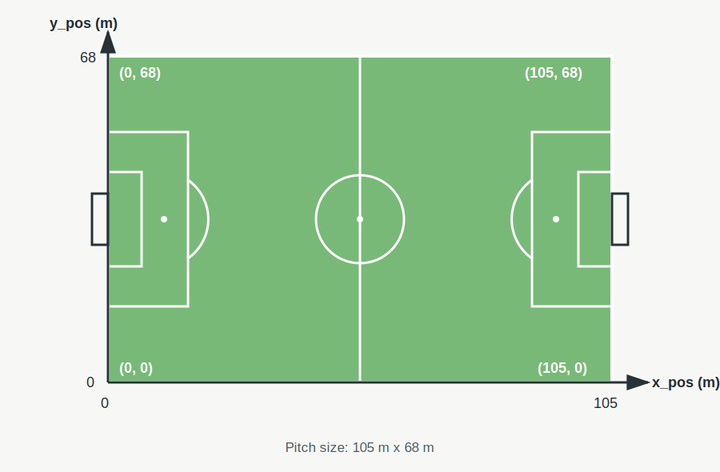
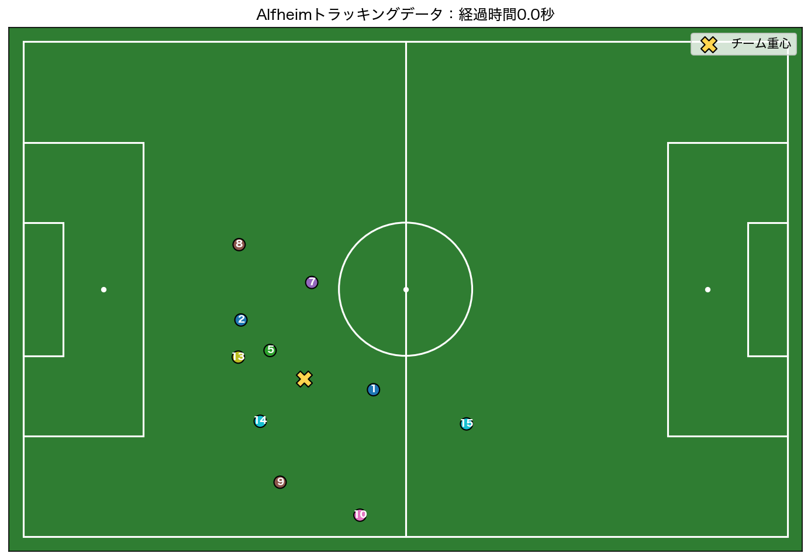
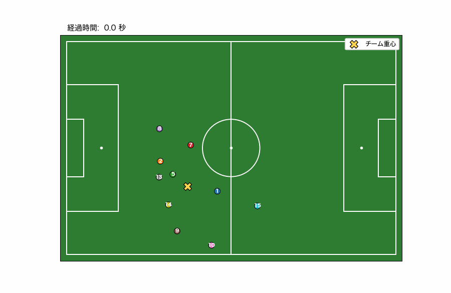
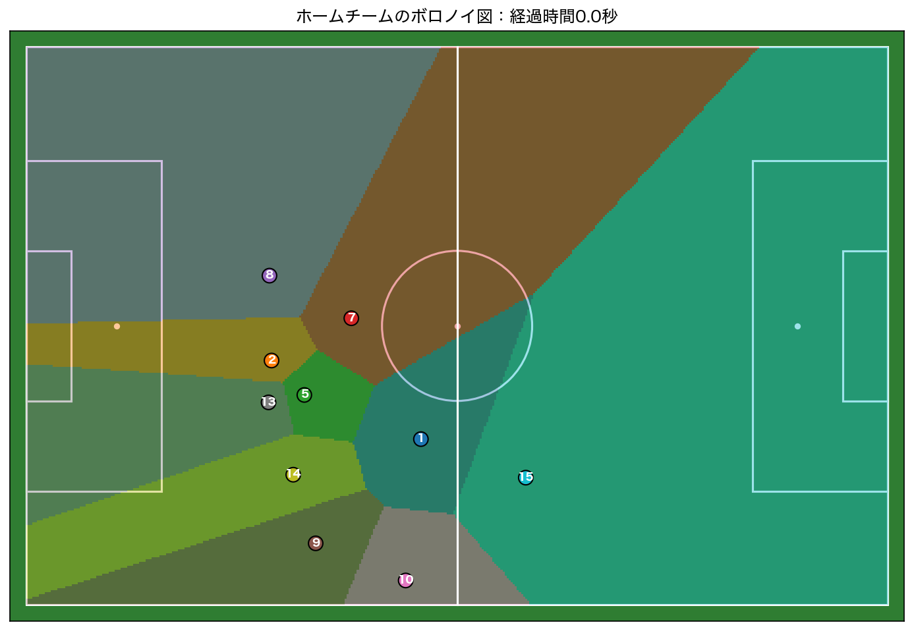

# 第12回　動画としての可視化（スポーツトラッキングデータ）

### 前回の復習

第11回はCPIと完全失業率を使って時系列データを分析した．

| 観点 | 第11回に行ったこと |
| --- | --- |
| 時間 | 年月を日付型へ変換し，時間順に並べた |
| 変換 | ラグ，差分，移動平均，前年同月比を計算した |
| 可視化 | 時系列グラフと散布図を使った |
| 比較 | 同じ年月の2系列を結合し，相関を調べた |

今回も時間順序を持つデータを扱うが，1つの時刻に複数の選手の2次元座標が記録されている点が異なる．

### 今回の位置づけ

第12回ではサッカーの**トラッキングデータ**を扱う．
トラッキングデータは試合中の選手やボールの位置を短い時間間隔で繰り返し記録したデータである．

<!-- 参考資料[「2次元運動計測とその処理」](../documents/12/text_soccer.pdf)で扱われている位置ベクトル，速さ，チームの重心をPythonで確認する． -->
選手の位置ベクトル，速さ，チームの重心をPythonで確認する．
最後に，選手の位置をサッカーピッチ上へ描き，時間とともに更新するGIF形式の動画と，選手の配置を領域として表すボロノイ図を作成する．

### 到達目標

- 選手の位置とチームの重心をピッチ上へ可視化できる
- `matplotlib.animation`を使って時間変化を動画として保存できる
- ボロノイ図の意味を説明し，選手の配置を領域として解釈できる
- 動画から読み取れることと，データの制約を区別して説明できる

**今回の流れ**

| 段階 | 内容 | 目的 |
| --- | --- | --- |
| 1 | トラッキングデータを理解する | 1行と1フレームの意味を知る |
| 2 | 公開条件を確認する | データを適切に利用する |
| 3 | データを取得・前処理する | 20Hzの元データから30秒間を5fpsで抽出する |
| 4 | 1フレームを可視化する | 座標とチーム重心を確認する |
| 5 | 動画を作成する | 選手の動きを時間順に見る |
| 6 | 表現方法を変える | 速さを色で表して情報を加える |
| 7 | ボロノイ図を作る | 選手の配置を担当領域として見る |

---

## 準備

````{note} 演習0：作業フォルダを作成する

1. ターミナルで次のコマンドを順に実行する．

```bash
cd /Users/<ユーザ名>/applied_programming_i
mkdir 12
cd 12
mkdir -p notebooks data/raw data/processed src reports/figures
git init
```

2. 必要なライブラリをインストールする．

```bash
python3 -m pip install --upgrade requests pandas numpy matplotlib pillow
```

3. JupyterLabまたはVS Codeで`notebooks/tracking.ipynb`を新規作成する．

4. `README.md`を作成し，次の内容を記入する．

```markdown
# 応用プログラミングI 第12回

- 氏名：<氏名>
- 学籍番号：<学籍番号>

## 今日の目標

サッカーのトラッキングデータを取得し，選手の動きを動画として可視化する．

## 第12回 分析記録

- テーマ：サッカー選手の位置は時間とともにどのように変化するか
- データ名：Soccer Video and Player Position Dataset
- 提供者：Simula Research Laboratoryほか
- 取得元：https://datasets.simula.no/alfheim/
- 取得日：<データを取得した日>
- 利用条件：非商用研究目的に限る．再識別や選手・クラブのプロファイル作成は禁止
- 元データ：data/raw/alfheim_tracking_first.csv
- 前処理済みデータ：data/processed/alfheim_tracking_5fps.csv
- 観察用ノートブック：notebooks/tracking.ipynb（Gitでは管理しない）
- 使用するスクリプト：src/prepare_alfheim_tracking.py
- 出力する図・動画：
  - reports/figures/alfheim_frame.png
  - reports/figures/tracking_speed_frame.png
  - reports/figures/alfheim_tracking.gif
  - reports/figures/alfheim_tracking_speed.gif
  - reports/figures/team_voronoi_frame.png
```

5. `.gitignore`を作成する．

```gitignore
.DS_Store
*.swp
*~
.vscode/
.ipynb_checkpoints/
*.ipynb
data/raw/
```

6. 作成したファイルをコミットする．

```bash
git add .
git commit -m "first commit"
```
````

---

## トラッキングデータ

トラッキングデータでは，時刻$t$における選手$i$の位置を2次元の位置ベクトル

$$
\boldsymbol{r}_i(t)
=[x_i(t),y_i(t)]
$$

として表している．
時刻$t-\Delta t$から$t$までの変位は

$$
\Delta\boldsymbol{r}_i(t)
=[x_i(t)-x_i(t-\Delta t), y_i(t)-y_i(t-\Delta t)]
$$

である．
移動距離を時間間隔で割って平均の速さが得られる．

$$
v_i(t)
=\frac{\sqrt{[x_i(t)-x_i(t-\Delta t)]^2+[y_i(t)-y_i(t-\Delta t)]^2}}{\Delta t}
$$

今回使用する元データには，位置座標に加えて計測システムが求めた`speed`も含まれている．

### 1行と1フレーム

元データはエッジリスト形式（long format）であり，1行が1つの時刻における1人の選手に対応する．

| 列 | 内容 | 単位 |
| --- | --- | --- |
| `timestamp` | 計測時刻 | 日時 |
| `tag_id` | 匿名化されたセンサーID | なし |
| `x_pos` | ピッチ長辺方向の位置 | m |
| `y_pos` | ピッチ短辺方向の位置 | m |
| `speed` | 選手の速さ | m/s |

同じ時刻に記録された複数選手の行をまとめたものが1フレームとなる．
フレームを時間順に切り替えると動画になる．

### チームの重心

1つのフレームに$n$人の選手がいるとき，チームの重心は各座標の平均で表す．

$$
x_c(t)=\frac{1}{n}\sum_{i=1}^{n}x_i(t),
\qquad
y_c(t)=\frac{1}{n}\sum_{i=1}^{n}y_i(t)
$$

```python
centroid_x = frame_df["x_pos"].mean()
centroid_y = frame_df["y_pos"].mean()
```

```{tip} 重心を解釈するときの注意
重心は選手の位置を1点に要約した値である．
同じ重心でも選手の広がり方や配置は異なるため，重心だけでチームの状態を判断してはいけない．
```

---

## 使用する公開研究データ

今回はSimulaが公開する[Alfheimデータセット](https://datasets.simula.no/alfheim/)を使用する．
データの形式は[Pettersenほかのデータセット論文](https://home.simula.no/~paalh/publications/files/mmsys2014-dataset.pdf)で説明されている．

| 項目 | 内容 |
| --- | --- |
| 試合 | 2013年11月3日 Tromsø IL（トロムソ）対<br>Strømsgodset IF（ストレームスゴトセト） |
| 計測対象 | ホームチームのセンサー装着選手 |
| 計測頻度 | 20Hz，1秒間に20回 |
| ピッチ | $105\times68$ m |
| 座標 | $0\leq x\leq105$，$0\leq y\leq68$がピッチ内 |
| ボール座標 | 含まれない |
| 元ファイル | 前半の補間済み位置CSV，約83MB |



ピッチ左下を原点$(0,0)$とし，長辺方向を$x$軸，短辺方向を$y$軸とする．

このデータにはアウェイチームの位置・ボール位置は含まれていない．
選手IDはプライバシー保護のために匿名化されており，背番号ではない．

```{tip} 公開データでも利用条件を確認する
[Alfheimデータセット公式ページ](https://datasets.simula.no/alfheim/)（確認日：2026年7月4日）の「Randomized sensor tags」には，次のように記載されている．

> “The data may only be used for non-commercial research purposes.”

> “attempts to re-identify individual players, create player/club performance profiles, and similar, are not allowed.”

AlfheimデータセットはWeb上で公開されているが，利用は非商用研究目的に限られる．
選手を再識別することや，選手・クラブの能力を評価するプロファイルを作成することは禁止されている．
この講義では匿名化された座標データを可視化手法の学習だけに使用する．
```

---

## データを取得・前処理する

20Hzの前半全データをそのまま動画にするとフレーム数が多く，処理にも時間がかかる．
元データはSimulaの公式サイトから直接取得し，配布スクリプトを使って次の前処理をまとめて行う．

| 処理 | 内容 |
| --- | --- |
| ダウンロード | 公式サイトから約83MBの補間済み位置CSVを取得する |
| 列の選択 | 時刻，選手ID，$x$座標，$y$座標，速さだけを読む |
| 時間抽出 | 18時35分00秒から30秒間を残す |
| 座標抽出 | ピッチ内の座標だけを残す |
| 間引き | 20Hzから5fpsへ変換する |
| 選手抽出 | 80%以上のフレームで記録された選手を残す |

`````{note} 演習1：データを取得して授業用CSVを作る
**手順1：公式サイトから元データを取得する**

[Alfheimデータセット公式ページ](https://datasets.simula.no/alfheim/)で公開元とデータの説明を確認する．
その後，`12`フォルダ内で次のコマンドを実行し，[前半の元データCSV](https://datasets.simula.no/downloads/alfheim/2013-11-03/zxy/2013-11-03_tromso_stromsgodset_first.csv)を公式サイトから直接取得する．

```bash
mkdir -p data/raw

curl --fail --location --progress-bar \
  "https://datasets.simula.no/downloads/alfheim/2013-11-03/zxy/2013-11-03_tromso_stromsgodset_first.csv" \
  --output data/raw/alfheim_tracking_first.csv
```

約83MBのファイルを取得するため，通信環境によって時間がかかる．
取得後，`data/raw/alfheim_tracking_first.csv`が作成されていることを確認する．

**手順2：前処理用スクリプトを準備する**

次のzipファイルをダウンロードし，`src`へ解凍する．
このzipにデータは含まれておらず，Pythonファイルだけが含まれている．

[alfheim_tracking_scripts.zip](./analysis/12/src/alfheim_tracking_scripts.zip)

ターミナルから解凍する場合は，ダウンロード先に合わせて次を実行する．

```bash
unzip ~/Downloads/alfheim_tracking_scripts.zip -d src
```

※ ダウンロードできない場合次のコードを記載したスクリプトファイルをsrcフォルダに作成する（`src/animate_alfheim_speed.py`）．

````{dropdown} 前処理のスクリプトファイル
```python
from pathlib import Path

import matplotlib.pyplot as plt
import numpy as np
import pandas as pd
from matplotlib.animation import FuncAnimation, PillowWriter
from matplotlib.colors import Normalize

from animate_alfheim_tracking import draw_pitch


input_path = Path(
    "data/processed/alfheim_tracking_5fps.csv"
)
output_path = Path(
    "reports/figures/alfheim_tracking_speed.gif"
)
fps = 5

plt.rcParams["font.family"] = "Hiragino Sans"

tracking_df = pd.read_csv(
    input_path,
    parse_dates=["timestamp"],
)

player_ids = sorted(tracking_df["tag_id"].unique())
frame_ids = sorted(tracking_df["frame"].unique())

fig, ax = plt.subplots(figsize=(10, 6.5))
draw_pitch(ax)

speed_norm = Normalize(vmin=0, vmax=7)
players = ax.scatter(
    [],
    [],
    s=100,
    c=[],
    cmap="viridis",
    norm=speed_norm,
    edgecolors="black",
    linewidths=0.8,
    zorder=3,
)
centroid = ax.scatter(
    [],
    [],
    s=160,
    c="#ffd54f",
    marker="X",
    edgecolors="black",
    label="チーム重心",
    zorder=4,
)
labels = {
    tag_id: ax.text(
        0,
        0,
        str(tag_id),
        ha="center",
        va="center",
        fontsize=8,
        color="white",
        weight="bold",
        zorder=5,
    )
    for tag_id in player_ids
}
time_text = ax.text(
    0.02,
    1.02,
    "",
    transform=ax.transAxes,
    fontsize=12,
)

colorbar = fig.colorbar(players, ax=ax, pad=0.02)
colorbar.set_label("速さ（m/s）")
ax.legend(loc="upper right", framealpha=0.9)


def update(frame):
    frame_df = (
        tracking_df[tracking_df["frame"] == frame]
        .set_index("tag_id")
    )

    positions = []
    speeds = []

    for tag_id in player_ids:
        if tag_id not in frame_df.index:
            labels[tag_id].set_visible(False)
            continue

        x_pos = float(frame_df.loc[tag_id, "x_pos"])
        y_pos = float(frame_df.loc[tag_id, "y_pos"])
        positions.append([x_pos, y_pos])
        speeds.append(float(frame_df.loc[tag_id, "speed"]))

        labels[tag_id].set_position((x_pos, y_pos))
        labels[tag_id].set_visible(True)

    players.set_offsets(np.asarray(positions))
    players.set_array(np.asarray(speeds))
    centroid.set_offsets([
        [
            frame_df["x_pos"].mean(),
            frame_df["y_pos"].mean(),
        ]
    ])
    time_text.set_text(
        f"経過時間: {frame / fps:4.1f} 秒"
    )

    return [
        players,
        centroid,
        time_text,
        *labels.values(),
    ]


animation = FuncAnimation(
    fig,
    update,
    frames=frame_ids,
    interval=1000 / fps,
    blit=False,
)

output_path.parent.mkdir(parents=True, exist_ok=True)
animation.save(
    output_path,
    writer=PillowWriter(fps=fps),
    dpi=90,
)
plt.close(fig)

print("saved:", output_path)
```
````

**手順3：元データを前処理する**

`12`フォルダ内で前処理スクリプトを実行する．

```bash
python3 src/prepare_alfheim_tracking.py
```

正常に終了すると次のように表示される．

```text
rows: 1500
frames: 150
players: 10
saved: data/processed/alfheim_tracking_5fps.csv
```

`data/processed/alfheim_tracking_5fps.csv`が作成されたことを確認する．
`````

```{tip} 元データをGitで管理しない
約83MBの元データは再取得できるため，`data/raw/`を`.gitignore`へ登録する．
一方，前処理の手順を記録したPythonスクリプトはGitで管理する．
```

---

## データの中身を確認する

````{note} 演習2：前処理済みCSVをNotebookで確認する
`notebooks/tracking.ipynb`に「データの確認」という見出しを作り，次のセルを順番に実行せよ．

**セル1：CSVを読み込む**

```python
# 前処理済みトラッキングデータを読み込む．
import pandas as pd


tracking_df = pd.read_csv(
    "../data/processed/alfheim_tracking_5fps.csv",
    parse_dates=["timestamp"],
)

tracking_df.head()
```

**セル2：表の大きさと列を確認する**

```python
print("行数・列数:", tracking_df.shape)
print("選手数:", tracking_df["tag_id"].nunique())
print("フレーム数:", tracking_df["frame"].nunique())
print(
    "経過時間:",
    tracking_df["elapsed_seconds"].min(),
    "〜",
    tracking_df["elapsed_seconds"].max(),
)
```

**セル3：座標と速さの範囲を確認する**

```python
tracking_df[
    ["x_pos", "y_pos", "speed"]
].describe()
```

**セル4：最初のフレームを確認する**

```python
frame_df = tracking_df[
    tracking_df["frame"] == 0
]

print("フレーム内の選手数:", len(frame_df))
frame_df[
    ["frame", "tag_id", "x_pos", "y_pos", "speed"]
]
```

実行後，次を確認せよ．

1. 1500行，150フレーム，10選手であるか
2. 1フレームに各選手の行が1行ずつあるか
3. `x_pos`と`y_pos`はピッチ内の範囲にあるか
4. `tag_id`は連続した番号とは限らないか
````

---

## 1フレームをピッチ上に可視化する

最初に，動画の1コマに相当する静止画を作る．
ピッチの大きさとデータの座標範囲を一致させることが重要である．

````{note} 演習3：選手位置とチーム重心を描く
「1フレームの可視化」という見出しを作り，次のセルを順番に実行せよ．

**セル1：ピッチを描く関数を定義する**

```python
# サッカーピッチを105m×68mの座標で描く．
from pathlib import Path

import matplotlib.pyplot as plt
import pandas as pd
from matplotlib.patches import Circle, Rectangle


plt.rcParams["font.family"] = "Hiragino Sans"

tracking_df = pd.read_csv(
    "../data/processed/alfheim_tracking_5fps.csv",
    parse_dates=["timestamp"],
)


def draw_pitch(ax):
    line_style = {
        "fill": False,
        "edgecolor": "white",
        "linewidth": 1.5,
    }

    ax.set_facecolor("#2f7d32")
    ax.add_patch(
        Rectangle((0, 0), 105, 68, **line_style)
    )
    ax.plot(
        [52.5, 52.5],
        [0, 68],
        color="white",
        linewidth=1.5,
    )
    ax.add_patch(
        Circle((52.5, 34), 9.15, **line_style)
    )
    ax.add_patch(
        Rectangle(
            (0, 13.84), 16.5, 40.32, **line_style
        )
    )
    ax.add_patch(
        Rectangle(
            (88.5, 13.84), 16.5, 40.32, **line_style
        )
    )
    ax.add_patch(
        Rectangle(
            (0, 24.84), 5.5, 18.32, **line_style
        )
    )
    ax.add_patch(
        Rectangle(
            (99.5, 24.84), 5.5, 18.32, **line_style
        )
    )
    ax.scatter(
        [52.5, 11, 94],
        [34, 34, 34],
        color="white",
        s=12,
    )

    ax.set_xlim(-2, 107)
    ax.set_ylim(-2, 70)
    ax.set_aspect("equal")
    ax.set_xticks([])
    ax.set_yticks([])
```

**セル2：最初のフレームを描いて保存する**

```python
# 選手位置と座標平均から求めたチーム重心を描く．
frame_df = tracking_df[
    tracking_df["frame"] == 0
]

fig, ax = plt.subplots(figsize=(10, 6.5))
draw_pitch(ax)

ax.scatter(
    frame_df["x_pos"],
    frame_df["y_pos"],
    c=frame_df["tag_id"],
    cmap="tab10",
    s=100,
    edgecolors="black",
    zorder=3,
)

for row in frame_df.itertuples():
    ax.text(
        row.x_pos,
        row.y_pos,
        str(row.tag_id),
        ha="center",
        va="center",
        fontsize=8,
        color="white",
        weight="bold",
        zorder=4,
    )

centroid_x = frame_df["x_pos"].mean()
centroid_y = frame_df["y_pos"].mean()

ax.scatter(
    [centroid_x],
    [centroid_y],
    color="#ffd54f",
    marker="X",
    s=170,
    edgecolors="black",
    label="チーム重心",
    zorder=5,
)

ax.set_title(
    "Alfheimトラッキングデータ：経過時間0.0秒"
)
ax.legend(loc="upper right")

output_path = Path(
    "../reports/figures/alfheim_frame.png"
)
output_path.parent.mkdir(parents=True, exist_ok=True)

plt.tight_layout()
plt.savefig(output_path, dpi=150, bbox_inches="tight")
plt.show()

print("saved:", output_path)
```
````



図の番号は匿名化された`tag_id`であり，選手の背番号ではない．
黄色のXは，そのフレームで観測された10人の重心（座標平均）である．

---

## 選手の動きを動画として可視化する

`matplotlib.animation.FuncAnimation`は，フレーム番号ごとに描画内容を更新して動画を作る．

```python
animation = FuncAnimation(
    fig,
    update,
    frames=frame_ids,
    interval=1000 / fps,
)
```

今回の`update()`関数では，フレームごとに次の処理を行う．

1. 該当フレームの行を抽出する
2. 選手マーカーの座標を更新する
3. 選手IDの表示位置を更新する
4. チーム重心を計算して更新する
5. 経過時間を更新する

GIFはPillowを使って保存するため，別途`ffmpeg`をインストールする必要はない．

````{note} 演習4：動画を作成する
`notebooks/tracking.ipynb`に「選手の動きの動画」という見出しを作り，次のセルを順番に実行せよ．
演習3のセル1で定義した`draw_pitch()`と，読み込んだ`tracking_df`を使用する．

**セル1：動画に必要な準備をする**

```python
# 動画の保存とNotebook内での表示に必要な機能を読み込む．
from IPython.display import Image, display
import numpy as np
from matplotlib.animation import FuncAnimation, PillowWriter


fps = 5
player_ids = sorted(tracking_df["tag_id"].unique())
frame_ids = sorted(tracking_df["frame"].unique())

color_map = plt.colormaps["tab10"]
player_colors = {
    tag_id: color_map(index % 10)
    for index, tag_id in enumerate(player_ids)
}
```

**セル2：更新する図形を準備する**

```python
# 選手，重心，選手ID，経過時間を描く領域を準備する．
fig, ax = plt.subplots(figsize=(10, 6.5))
draw_pitch(ax)

players = ax.scatter(
    [],
    [],
    s=90,
    edgecolors="black",
    linewidths=0.8,
    zorder=3,
)
centroid = ax.scatter(
    [],
    [],
    s=160,
    c="#ffd54f",
    marker="X",
    edgecolors="black",
    label="チーム重心",
    zorder=4,
)
labels = {
    tag_id: ax.text(
        0,
        0,
        str(tag_id),
        ha="center",
        va="center",
        fontsize=8,
        color="white",
        weight="bold",
        zorder=5,
    )
    for tag_id in player_ids
}
time_text = ax.text(
    0.02,
    1.02,
    "",
    transform=ax.transAxes,
    fontsize=12,
)
ax.legend(loc="upper right", framealpha=0.9)
```

**セル3：フレームを更新する関数を定義する**

```python
# 指定されたフレームの座標へ選手と重心を移動する．
def update(frame):
    frame_df = (
        tracking_df[tracking_df["frame"] == frame]
        .set_index("tag_id")
    )

    positions = []
    colors = []

    for tag_id in player_ids:
        if tag_id not in frame_df.index:
            labels[tag_id].set_visible(False)
            continue

        x_pos = float(frame_df.loc[tag_id, "x_pos"])
        y_pos = float(frame_df.loc[tag_id, "y_pos"])
        positions.append([x_pos, y_pos])
        colors.append(player_colors[tag_id])

        labels[tag_id].set_position((x_pos, y_pos))
        labels[tag_id].set_visible(True)

    players.set_offsets(np.asarray(positions))
    players.set_facecolors(colors)
    centroid.set_offsets([
        [
            frame_df["x_pos"].mean(),
            frame_df["y_pos"].mean(),
        ]
    ])
    time_text.set_text(
        f"経過時間: {frame / fps:4.1f} 秒"
    )

    return [
        players,
        centroid,
        time_text,
        *labels.values(),
    ]
```

**セル4：動画を作成して保存する**

```python
# 全フレームを5fpsでGIFへ保存し，Notebook内に表示する．
animation = FuncAnimation(
    fig,
    update,
    frames=frame_ids,
    interval=1000 / fps,
    blit=False,
)

output_path = Path(
    "../reports/figures/alfheim_tracking.gif"
)
output_path.parent.mkdir(parents=True, exist_ok=True)

animation.save(
    output_path,
    writer=PillowWriter(fps=fps),
    dpi=90,
)
plt.close(fig)

print("saved:", output_path)
display(Image(filename=str(output_path)))
```

実行後，次を確認すること．

1. 30秒間の動きが5fpsで再生されるか
2. 同じ選手IDが時間とともに移動するか
3. チーム重心も選手の配置に応じて移動するか
````



```{tip} 動画から分かることと分からないこと
動画からは選手の移動方向，配置，チーム重心の変化を確認できるが，
アウェイチーム，ボール，試合中のイベントがないため，なぜ選手が移動したかまでは判断できない．
```

```{tip} 注意：Notebookのファイルサイズ
Notebook上で長時間・高fpsの動画を作成すると，ファイルサイズが大きくなることに注意する．
ファイルを保存する際には出力を全てクリアするファイルサイズが小さくなる．
ただし，再度上から順に実行して同じ出力が得られるかは確認しておく必要がある．
```

````{warning} 課題1：速さを色で表した静止画と動画を作る
Notebookに「課題1」という見出しを作り，速さを色で表した静止画を作成した後，同じ表現を動画へ発展させよ．
ただし次の条件を満たすこと．

- 取得したデータのうち，一番最後のフレームの静止画を作成する．

**セル1：速さを色で表した静止画を作る**

次の`<HOGEHOGE1>`〜`<HOGEHOGE5>`を適切に書き換えて実行すること．

```python
# 1フレームの選手位置を速さで色分けして保存する．
speed_frame_df = tracking_df[
    tracking_df["frame"] == <HOGEHOGE1>
]

fig, ax = plt.subplots(figsize=(10, 6.5))
draw_pitch(ax)

points = ax.scatter(
    speed_frame_df[<HOGEHOGE2>],
    speed_frame_df[<HOGEHOGE3>],
    c=speed_frame_df[<HOGEHOGE4>],
    cmap="viridis",
    vmin=0,
    vmax=7,
    s=110,
    edgecolors="black",
    zorder=3,
)

colorbar = fig.colorbar(points, ax=ax, pad=0.02)
colorbar.set_label(<HOGEHOGE5>)

ax.set_title("選手位置と速さ：経過時間0.0秒")

output_path = Path(
    "../reports/figures/tracking_speed_frame.png"
)
output_path.parent.mkdir(parents=True, exist_ok=True)

plt.tight_layout()
plt.savefig(output_path, dpi=150, bbox_inches="tight")
plt.show()

print("saved:", output_path)
```

**セル2以降：速さを色で表した動画を作る**

演習4のセルを複製し，次の条件を満たすように変更すること．

1. 選手を識別する色ではなく，`speed`を`viridis`で色分けする
2. 色の範囲を0m/sから7m/sに固定する
3. 「速さ（m/s）」と表示したカラーバーを付ける
4. 選手IDとチーム重心は残す
5. `../reports/figures/alfheim_tracking_speed.gif`として保存する

次の処理を参考にすること．

```python
from matplotlib.colors import Normalize


speed_norm = Normalize(vmin=0, vmax=7)

players = ax.scatter(
    [],
    [],
    c=[],
    cmap="viridis",
    norm=speed_norm,
)

players.set_array(np.asarray(speeds))
```

静止画と動画について，次を確認すること．

1. フレーム0を使用しているか
2. 横軸方向に`x_pos`，縦軸方向に`y_pos`を使用しているか
3. `speed`を`viridis`で色分けしているか
4. カラーバーに「速さ（m/s）」と表示されているか
5. 動画でも色の範囲が0m/sから7m/sに固定されているか

実行した課題コードを<span style="color:red">WebClass「第12回課題」問1</span>へ貼り付けること．
画像ファイル`reports/figures/tracking_speed_frame.png`を<span style="color:red">問2</span>から，GIFファイル`reports/figures/alfheim_tracking_speed.gif`を<span style="color:red">問3</span>から提出せよ．
````

<!--
````{dropdown} <span style="color:red">課題1 解答例</span>

- `<HOGEHOGE1>`：`0`
- `<HOGEHOGE2>`：`"x_pos"`
- `<HOGEHOGE3>`：`"y_pos"`
- `<HOGEHOGE4>`：`"speed"`
- `<HOGEHOGE5>`：`"速さ（m/s）"`

動画では，`update()`内で各フレームの`speeds`を作り，`players.set_array(np.asarray(speeds))`で色を更新する．
解答例の全体は`contents/analysis/12/src/animate_alfheim_speed.py`を参照すること．
````
-->

---

## ボロノイ図で選手の配置を分析する

### ボロノイ図とは

ボロノイ図は，平面上の各地点を，最も近い基準点ごとの領域に分割した図である．
選手$i$の位置を$\boldsymbol{p}_i$，ピッチ内の任意の地点を$\boldsymbol{x}$とすると，選手$i$のボロノイ領域$V_i$は

$$
V_i
=
\left\{
\boldsymbol{x}
\mid
\lVert \boldsymbol{x}-\boldsymbol{p}_i \rVert
\leq
\lVert \boldsymbol{x}-\boldsymbol{p}_j \rVert,
\quad \text{すべての }j\neq i
\right\}
$$

と表される．
同じ領域内のどの地点も，他の選手より選手$i$に近い．
境界線上では，隣り合う2人以上の選手までの距離が等しい．

### ボロノイ図から分かること

| 観点 | 図から確認できること |
| --- | --- |
| 担当領域の大きさ | 大きい領域を持つ選手は，周囲の味方から離れて配置されている |
| 選手間の密集 | 小さい領域が集まる場所では，複数の選手が近くにいる |
| ピッチの被覆 | チームがピッチのどの範囲へ広がっているかを確認できる |
| 時間変化 | フレーム間で領域を比べると，配置の広がりや縮まりを確認できる |

ここでいう担当領域は，選手との距離だけで決まる幾何学的な領域である．
実際にその選手がボールへ先に到達できることや，その場所を支配していることを直接示すものではない．

```{tip} 今回のデータでの制約
今回のデータにはホームチームしか含まれないため，ボロノイ図は味方選手間の配置を分割した図である．
両チームの支配領域や優勢を分析するには，相手選手の座標も必要である．
また，単純なボロノイ図は選手の速さ，移動方向，ボール位置を考慮しない．
```

````{note} 演習5：チームのボロノイ図を描く
Notebookに「ボロノイ図」という見出しを作り，次のセルを順番に実行せよ．
ここではピッチを25cm間隔の格子に分け，各格子点に最も近い選手を調べることでボロノイ領域を近似する．

**セル1：最初のフレームと格子を準備する**

```python
# 最初のフレームについて，ピッチ上の各格子点を作る．
from matplotlib.colors import ListedColormap


voronoi_frame_df = (
    tracking_df[tracking_df["frame"] == 0]
    .sort_values("tag_id")
    .reset_index(drop=True)
)
player_points = voronoi_frame_df[
    ["x_pos", "y_pos"]
].to_numpy()

dx = 0.25
dy = 0.25
x_centers = np.arange(dx / 2, 105, dx)
y_centers = np.arange(dy / 2, 68, dy)
grid_x, grid_y = np.meshgrid(
    x_centers,
    y_centers,
)
```

**セル2：各格子点に最も近い選手を求める**

```python
# 格子点と各選手の距離を計算し，最も近い選手を選ぶ．
distance_squared = (
    (grid_x[:, :, None] - player_points[:, 0]) ** 2
    + (grid_y[:, :, None] - player_points[:, 1]) ** 2
)
nearest_player = distance_squared.argmin(axis=2)
```

`distance_squared`の第3軸は選手に対応する．
`argmin(axis=2)`は，各格子点について距離が最小となる選手番号を返す．

**セル3：ボロノイ図を描いて保存する**

```python
# 最も近い選手ごとに領域を色分けし，選手位置を重ねる．
voronoi_colors = plt.colormaps["tab10"](
    np.arange(len(voronoi_frame_df))
)
voronoi_cmap = ListedColormap(voronoi_colors)

fig, ax = plt.subplots(figsize=(10, 6.5))
draw_pitch(ax)

ax.imshow(
    nearest_player,
    extent=(0, 105, 0, 68),
    origin="lower",
    cmap=voronoi_cmap,
    alpha=0.42,
    interpolation="nearest",
    zorder=1,
)
ax.scatter(
    voronoi_frame_df["x_pos"],
    voronoi_frame_df["y_pos"],
    c=np.arange(len(voronoi_frame_df)),
    cmap=voronoi_cmap,
    s=110,
    edgecolors="black",
    zorder=3,
)

for row in voronoi_frame_df.itertuples():
    ax.text(
        row.x_pos,
        row.y_pos,
        str(row.tag_id),
        ha="center",
        va="center",
        fontsize=8,
        color="white",
        weight="bold",
        zorder=4,
    )

ax.set_title("ホームチームのボロノイ図：経過時間0.0秒")

output_path = Path(
    "../reports/figures/team_voronoi_frame.png"
)
output_path.parent.mkdir(parents=True, exist_ok=True)

plt.tight_layout()
plt.savefig(output_path, dpi=150, bbox_inches="tight")
plt.show()

print("saved:", output_path)
```

**セル4：各選手の領域面積を近似する**

```python
# 各選手に割り当てられた格子数から領域面積を求める．
cell_counts = np.bincount(
    nearest_player.ravel(),
    minlength=len(voronoi_frame_df),
)

voronoi_area_df = pd.DataFrame({
    "tag_id": voronoi_frame_df["tag_id"],
    "ボロノイ領域面積": cell_counts * dx * dy,
})

voronoi_area_df.sort_values(
    "ボロノイ領域面積",
    ascending=False,
)
```

実行後，領域面積が大きい選手と小さい選手を図中の配置と対応させて確認せよ．
領域が大きいことを選手の能力や貢献度の高さと解釈してはいけない．
````



---

## 最終レポートへの接続

最終レポートでも，次の順序を意識すること．

| 段階 | 第12回の例 | レポートで記録すること |
| --- | --- | --- |
| 問い | 選手の位置は時間とともにどう変化するか | 何を明らかにしたいか |
| 出典確認 | Alfheim公式サイトと利用条件 | URL，提供者，取得日，利用条件 |
| 前処理 | 時間帯抽出，座標範囲，5fpsへの間引き | どの行を残し，どのように加工したか |
| 可視化 | 静止画，位置動画，速さ動画，ボロノイ図 | 軸，単位，色，時間，領域の意味 |
| 解釈 | 配置，移動，重心，ボロノイ領域の変化 | 図から直接確認できる事実 |
| 限界 | 相手，ボール，イベントがない | データだけでは判断できないこと |

動く図は情報量が多いが，レポートでは動画だけに頼らず，代表的な静止画や集計表も併用する．

---

## まとめ

| 観点 | 今回学んだこと |
| --- | --- |
| データ | トラッキングデータは，時刻と対象IDを持つ多変量時系列データである |
| 座標 | 位置は2次元ベクトルで表され，ピッチと同じ座標範囲で描く必要がある |
| 前処理 | 高頻度データは，目的に応じて時間帯とフレーム数を減らす |
| 可視化 | 同じ描画領域でマーカーを時間順に更新すると動画になる |
| 要約 | チーム重心は配置を1点に要約するが，広がりまでは表さない |
| 領域 | ボロノイ図は，各地点を最も近い選手ごとの領域に分割する |
| 倫理 | 公開データでも利用条件を確認し，匿名化された個人の再識別を試みない |
| 解釈 | 相手やボールがない場合，移動の理由や戦術まで断定できない |

### 課題の提出期限

<span style="color:red">7月26日(日)23:59まで</span>

---

## 自主学習用の発展問題

課題を全てこなし時間が余った場合に取り組んでください．
以降の発展問題は特に提出期限を設けない．
各発展問題で作成したPythonファイルと出力ファイルをzip形式にまとめ，WebClass「第12回課題」の問5からまとめて提出すること．

````{note} 発展問題1：1人の選手の軌跡を描く
任意の`tag_id`を1つ選び，30秒間の$x$座標と$y$座標を線で結んでピッチ上に描け．
始点と終点を異なるマーカーで示すこと．

`src/plot_player_trajectory.py`を作成し，図を`reports/figures/player_trajectory.png`として保存すること．
````

````{note} 発展問題2：チームの広がりを計算する
各フレームについて，選手とチーム重心との距離を求め，その二乗平均平方根をチームの広がりとして計算せよ．

$$
s(t)
=
\sqrt{
\frac{1}{n}
\sum_{i=1}^{n}
\left\{
[x_i(t)-x_c(t)]^2
+
[y_i(t)-y_c(t)]^2
\right\}
}
$$

横軸を経過時間，縦軸をチームの広がりとして折れ線グラフを作成すること．

`src/plot_team_spread.py`を作成し，図を`reports/figures/team_spread.png`として保存すること．
````

````{note} 発展問題3：標本化頻度を変えて動画を比較する
前処理スクリプトの`--fps`を1，2，10のいずれかに変更してCSVと動画を作成せよ．
フレーム数，ファイルサイズ，動きの滑らかさが5fpsの場合とどのように変化するか考察すること．

元のファイルを上書きしないよう，`--output-path`と動画の保存先を変更すること．

例えば2fpsの場合は次のように実行する．

```bash
python3 src/prepare_alfheim_tracking.py \
  --fps 2 \
  --output-path data/processed/alfheim_tracking_2fps.csv

python3 src/animate_alfheim_tracking.py \
  --fps 2 \
  --input-path data/processed/alfheim_tracking_2fps.csv \
  --output-path reports/figures/alfheim_tracking_2fps.gif
```
````

### さらに学ぶための手法

| 手法 | 概要 |
| --- | --- |
| 選手間距離 | 選手同士がどの程度近いかを時系列で調べる |
| 速度ベクトル | 速さだけでなく移動方向も可視化する |
| チーム形状 | 重心，広がり，選手配置を組み合わせて見る |
| イベントデータ結合 | パスやシュートの時刻と位置を対応させる |

これらを適切に解釈するには，両チーム，ボール，試合イベントなどを含むデータが必要となる．
