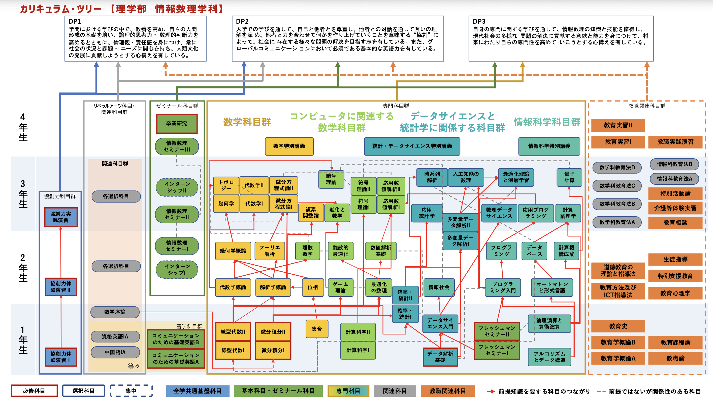
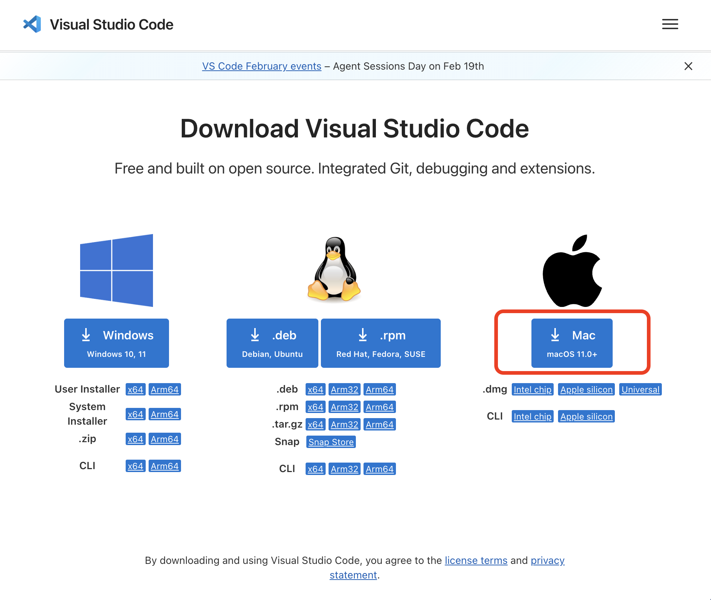

# 第1回　Python実行環境の確認とGitの導入

### カリキュラム



### スケジュール

1. ガイダンス、Python実行環境の確認とGitの導入
2. Gitの基本的な使い方
3. Gitの運用
4. オープンデータの取得と整理
5. APIの使い方
6. データの前処理I
7. データの前処理II
8. 可視化I：基本的な可視化
9. 可視化II：地図上への可視化
10. データ分析実践I：行政統計
11. データ分析実践II：経済データ
12. データ分析実践III：スポーツデータ
13. 最終レポートの案内（休講）

**開発管理の基礎（第1-3回）**

- Git による履歴管理，ブランチ，マージなど
- 分析作業を安全かつ体系的に行う基盤

**データ取得と前処理（第4-7回）**

- オープンデータの取得，API の利用，前処理，整形
- 実際のデータはそのままでは分析に適さないことが多いため，ここは実務上も学術上も重要な段階

**可視化（第8-9回）**

- 可視化の目的，注意点，誤解を招くグラフ，地図上への可視化など
- データの特徴を図として捉え，読み手に伝わる形に整理する

**データ分析実践と報告（第10-13回）**

- 行政統計，経済データ，スポーツデータを用いた分析実践例
- テーマ設定，データ取得，前処理，可視化，考察までを一連の流れとして学ぶ
- 第13回は休講とし，各自で最終レポートを作成する

本講義では，Python を用いたデータ分析を学ぶ．行政統計，気象，交通，経済，感染症，スポーツなどの公開データを題材として扱う．

データ分析は次の一連の過程からなる．

- 問題を定義する
- データを取得する
- データを整形する
- 可視化・分析する
- 結果を解釈して報告する
- 必要に応じて修正し，再分析する

分析を行うプログラムを作成するにあたり，編集履歴とその編集者の情報を残すことは重要である．Git はその基盤として実務の開発現場で利用される．

### テーマ

ガイダンス，Python実行環境の確認とGitの導入，VS Codeの環境設定

### 到達目標

- Python の実行環境が正しく動作することを確認する．
- Git の役割を説明でき，ローカル環境に Git を導入して基本確認をする．
- データ分析において，再現可能性と履歴管理がなぜ重要かを理解する．
- VS codeを導入する．

## 本講義用のプロジェクトフォルダを用意する

```{tip} コードの読み方

- 冒頭に`$`がついているコマンドは一般ユーザとして実行する．（`$ `以下の文字列を打ってEnterを押して実行する）
- 冒頭に`#`がついているコマンドはルートユーザとして実行する．
- ルートユーザ：PC上のあらゆる権限をもっているユーザ
```

1. ターミナルを起動する．
    
    ⌘+Spaceでスポットライト検索を起動 → 「ターミナル」と検索
    
2. ホームディレクトリに移動する．
    
    `$ cd` を実行
    
3. 作業用ディレクトリを作成する．
    
    `$ mkdir applied_programming_i`
    
4. 作業用ディレクトリに移動する．
    
    `$ cd applied_programming_i`

### 現在地を確認する

ターミナルでは，自分が今どのフォルダで作業しているかを常に意識する必要がある．次のコマンドを実行し，表示される内容を確認する．

```bash
$ pwd
$ ls
```

- `pwd` は現在の作業場所を表示する．
- `ls` は現在のフォルダ内にあるファイルやフォルダを表示する．
- 目的のフォルダにいない状態でPythonファイルを実行すると，`No such file or directory` などのエラーが出ることがある．


## Python実行環境の確認

確認事項

- Python コマンドが端末から実行でき，バージョンが確認できる
- 簡単なスクリプトが動作する
- 必要に応じてライブラリが導入可能である

Python コマンドが端末から実行でき，バージョンが確認できる．

- `$ python --version` または `$ python3 --version` を実行してpythonのバージョンが表示されればok．

<!-- %%%%%%%%%%%%%%%%%%%%%%%%%%% -->
<details>
<summary>Pythonがインストールされていない場合のインストール手順</summary>

### Homebrewを使う方法

Homebrewを使っている場合は，次の方法でPythonをインストールできる．

```bash
$ brew install python
```

インストール後，次を実行して確認する．

```bash
$ python3 --version
$ pip3 --version
```

Pythonのバージョンとpipのバージョンが表示されればインストールは完了．

### 公式インストーラを使う方法

1. 次のページにアクセスする．

    [https://www.python.org/downloads/macos/](https://www.python.org/downloads/macos/)

2. 最新の安定版の `Download macOS installer` をクリックする．

3. ダウンロードされた `.pkg` ファイルを開く．

4. インストーラの指示に従ってインストールする．基本的には `続ける`，`インストール` を順に選べばよい．

5. インストールが終わったら，ターミナルを一度閉じて開き直す．

6. 次のコマンドで確認する．

```bash
$ python3 --version
$ pip3 --version
```

Pythonのバージョンとpipのバージョンが表示されればインストールは完了．

### VS CodeでPythonを選択する

Pythonをインストールした後，VS Codeで `hello.py` を開く．画面右下または上部にPythonの実行環境を選択する表示が出たら，インストールしたPythonを選ぶ．

その後，VS Code内のターミナルで次を実行する．

```bash
$ python3 hello.py
```

ファイルの挙動が想定通りであれば完了．

</details>
<!-- %%%%%%%%%%%%%%%%%%%%%%%%%%% -->

簡単なスクリプトを動作させる．

- hello.pyというファイルを作成する
    - `$ vim hello.py` として次を記述する．
        
        ```jsx
        print("Hello!")
        ```
        
    - Esc → `:wq` としてファイルを保存して終了する．
- `$ python hello.py` または `$ python3 hello.py` を実行してHello!が出力されるか確認する．

必要に応じてライブラリを導入する．ただしインストール済みであればそのままで良い．

- `$ pip install numpy` または `$ pip3 install numpy` を実行してnumpyをインストールする．
- `$ pip install pandas` または `$ pip3 install pandas` を実行してnumpyをインストールする．
- `$ pip install scipy` または `$ pip3 install scipy` を実行してnumpyをインストールする．

## Gitとは

プログラムの変更履歴つき共同編集システム

### 特徴

1. 変更履歴を残す
    
    いつ，誰が，どのファイルを，どう変更したかを記録する．
    
2. 過去の状態に戻せる
    
    変更して失敗しても以前の安全な状態に戻せる．
    
3. 複数人で共同作業しやすくなる
    
    チームで同じプロジェクトを進める際に変更を整理して統合できる．
    

### プログラミングにおける試行錯誤の記録をとる

データ分析では，一度で正しい結果に到達することはむしろ少ない．データを読み込み，欠損値処理を変更し，可視化の方法を見直し，特徴量を変え，モデルを比較しながら結果を改善していく．

この過程は，時系列的に見ると

$$
A_0 \to A_1 \to A_2 \to \cdots \to A_n
$$

という状態遷移として表せる．ここで$A_t$は時刻$t$における分析環境の状態であり，コード$C_t$，設定$S_t$，入力データ$I_t$，出力結果$O_t$の組とする．

もし途中の状態が記録されていなければ，どの変更が結果の改善または悪化に影響したのかを判断することが難しくなる．Git ではこの状態遷移の要点を**コミット**という単位で記録する．

### 協働のための共通基盤

Git は一人で使っても有用であるが，本来は複数人での協働にも強い．研究室，企業，プロジェクト演習などで共同作業を行う際には，責任をもって自分の変更を明確に残すことが必要になる．

### 実行環境の確認

ターミナルで次を実行してバージョンを確認する．

`$ git --version`

### Gitのユーザ情報を確認する

Gitで変更履歴を記録する際には，誰が変更したのかを残すためのユーザ名とメールアドレスが必要になる．次のコマンドで設定済みか確認する．

```bash
$ git config --global user.name
$ git config --global user.email
```

何も表示されない場合は，次の形式で設定する．

```bash
$ git config --global user.name "自分の名前"
$ git config --global user.email "自分のメールアドレス"
```

この設定はPC全体に対するGitの基本設定であり，第2回以降のコミット作成で使用される．

## VS Codeの環境構築

1. [https://code.visualstudio.com/download](https://code.visualstudio.com/download) にアクセスし，下画像の⭕️をクリックする．

    

2. ダウンロードフォルダに入っている `VSCode-darwin-universal.dmg` を開く．
3. VS Codeのアイコンを Applications フォルダに移す（ドラッグ&ドロップする）．

```{image} ./figs/1/mov2-4-1.mp4
:alt: Visual Studio Codeのインストール動画
:width: 100%
```

### VS Codeで作業フォルダを開く

1. VS Codeを起動し，メニューバーから `ファイル` → `フォルダを開く...` を選び，作成した `applied_programming_i` フォルダを開く．

2. フォルダを開いたら，VS Code内のターミナルを表示する．
    メニューバーから `ターミナル` → `新しいターミナル`

3. VS Codeの画面下部にターミナルが表示されたら，次を実行する．

```bash
$ pwd
$ ls
```

通常のターミナルとVS Code内のターミナルは，同じコマンドを実行できる．

### Pythonファイルを少し変更する

`hello.py` をVS Codeで開き，次のように内容を変更する．

```python
print("Hello???")
```

保存した後，`$ python hello.py` または `$ python3 hello.py` を実行する．

### VS Codeの拡張機能を入れる

VS Codeは，拡張機能を追加することでPythonの編集やGitの操作をしやすくできる．本講義では，まずPython用の拡張機能を導入する．

### 拡張機能の画面を開く

1. VS Codeを起動する．
2. 画面左側の四角形が並んだアイコンをクリックする．
3. 検索欄に拡張機能名を入力する．
4. 目的の拡張機能を選び，`Install` をクリックする．

左側のアイコンが見つからない場合は，メニューバーから次を選ぶ．

```text
表示 → 拡張機能
```

または，ショートカットキーで開くこともできる．

```text
Shift + Command + X
```

### インストールする拡張機能

次の拡張機能を検索してインストールする．

1. `Python`
    
    Microsoftが提供しているPython用の拡張機能である．Pythonファイルの実行，文法チェック，補完などに利用する．

2. `Japanese Language Pack for Visual Studio Code`
    
    VS Codeの表示を日本語化する拡張機能である．すでに日本語表示になっている場合は不要である．

余裕がある場合は，次の拡張機能も入れておくとGitの履歴を確認しやすい．

3. `Git Graph`
    
    Gitのコミット履歴やブランチの流れを図として確認できる．第2回以降のGitの学習で役立つ．

### Python拡張機能の動作確認

`hello.py` をVS Codeで開く．画面右下や上部にPythonの実行環境を選ぶ表示が出た場合は，インストール済みのPythonを選択する．

その後，`hello.py` を開いた状態で，画面右上の実行ボタンを押すか，VS Code内のターミナルで次を実行する．

```bash
$ python hello.py
```

`python` で実行できない場合は，次を試す．

```bash
$ python3 hello.py
```

## まとめ

授業全体の見通しを確認し，Python 実行環境と Git の導入・確認を行った．

第2回では，Git の基本的な使い方を学ぶ．具体的には，リポジトリ，作業ツリー，ステージング領域，コミット，履歴確認といった概念を扱い，編集過程をどのように記録するかを実践的に理解する．
