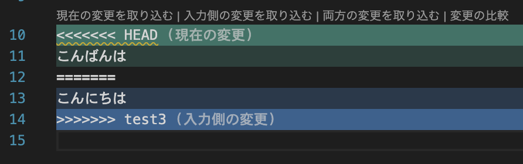

# 第3回　Gitの運用

### 前回の復習

- Git ではファイルは状態を持ち，操作によって遷移する
- 作業ツリー，ステージング領域，ローカルリポジトリを区別して理解できる
- 基本操作：`git status`，`git add`，`git commit`，`git log`，`git diff`
- コミットは小さく，意味の明確な単位で行う方がよい
- VSCode のソース管理は便利だが，端末操作との対応を理解して使うことが重要である

しかし，実際の分析や開発では，1つの作業だけを順番に進めるとは限らない．新しい分析案を試したいこともあれば，安定版を残したまま別案を検証したいこともある．また，複数人で同じプロジェクトに参加する場合には，各自が異なる作業を並行して進める必要がある．

### 到達目標

前回は一直線の履歴として進むプロジェクトを扱った．
実際の分析や開発の現場では1つの作業だけを順番に進めるとは限らず，複数人で同じプロジェクトに参加する場合には各自が異なる作業を並行して進める必要が生じる．
この際に使用するGitの機能を学ぶ．

- ブランチ，マージ，HEAD の概念を理解する．
- Git の履歴を単なる直線ではなく，分岐をもつグラフとして理解する．
- 複数の作業系列を安全に並行して進めるための基本的な運用手順を実行できるようになる．
- コンフリクトがなぜ起こるのかを説明し，基本的な解消を行えるようになる．
<!-- - データ分析プロジェクトにおいて，ブランチ運用が再現可能性と試行錯誤の両立にどう役立つかを説明できる． -->

### 準備

````{note} 演習0
本講義で使用するフォルダ `/User/<ユーザ名>/applied_programming_i/` 内に，本日使用するフォルダ `3` を作成し，次の`README.md`ファイルを作成した上でgitの初期化を行うこと．

```markdown
# 応用プログラミングI 第3回

- 氏名：<氏名>
- 学籍番号：<学籍番号>

## 今日の目標

ブランチとマージの意味を理解し，基本的な運用を体験する．
```
````

**手順**

1. ターミナルを起動
   1. フォルダ移動（`$ cd /User/<ユーザ名>/applied_programming_i/`）
   2. フォルダ`3`を作成（`$ mkdir 3`）
2. VSCodeを起動
   1. フォルダ`/User/<ユーザ名>/applied_programming_i/3`を開く
   2. `README.md`ファイルを作成する
3. Gitの初期化を行う
   1. 左のGitタブを開き「リポジトリを初期化する」を選択する
4. 最初のコミットを行い初期状態を記録する
   1. 全てのファイルをステージング領域に上げる
   2. コミットする（メッセージを忘れずにつけること）

```{image} ./figs/3/mov0-1.mp4
:alt: 準備
:width: 100%
```

---

## ブランチ (branch)

第2回までは履歴は
$$
C_0 \to C_1 \to C_2 \to \cdots \to C_n
$$
のような直線的な時系列として表した．ここで $C_i$ はコミットを表す．

このような単一の時系列のみの運用では次の状況に対応できない．

- 現在の安定版を保ったまま新機能を試したい
- 可視化の案を2通り**比較**したい
- 前処理方法を**複数並行**して検討したい
- 複数人が**別々の作業**を進めた後で**統合**したい

そこでブランチの機能を利用する．

### 考え方

ブランチ (branch)：履歴を複数の系列に分けて管理するGitの機能

ブランチを使うことで，たとえば安定版の系列を保ったまま，別の系列で新しい分析手法を試せる．
うまくいった場合だけ本流に取り込み，うまくいかなければ試行用の系列を破棄できる．
これは有向グラフ上の複数の経路を管理することに対応する．

ブランチ自体は変更履歴の系列における最新のコミットに対する参照である．  
（新しくコミットされると，そのコミットへの参照に切り替わる）

### 名称

- 本流のブランチは `main` または `master` と名付けられる．

※ 2020年以降，本流ブランチ名には `main` を使用する流れがある．（奴隷制における「主人」を想起させるため）

- `main` ブランチ以外には任意の名前を設定できる．
- `HEAD`：現在自分がどのブランチとコミットを基準に作業しているかを示す特別な参照．
- ブランチの切り替え：`HEAD` の参照先の変更

---

## ブランチ操作

### 局所的試行の分離

ある時刻 $t$ における分析作業の状態を $S_t$，変換を $T_t$ とする．単純な逐次作業では
$$
S_{t+1}=T_t(S_t)
$$
のように状態更新が進む．
しかし現実には，同じ $S_t$ から異なる変換 $T_t^{(1)}$ と $T_t^{(2)}$ を試したいことがある．このとき，
$$
S_{t+1}^{(1)}=T_t^{(1)}(S_t), \qquad
S_{t+1}^{(2)}=T_t^{(2)}(S_t)
$$
という2つの後続状態が生まれる．

このように同じ出発点から複数の系列を展開するときにブランチを使用する．

- `main`ブランチ：$S_{t+1}^{(1)}$ をコミット $C_{t+1}^{(1)}$ とすると，`main`ブランチの参照先は $C_{t+1}^{(1)}$ となる．
- `sub`ブランチ：コミット $C_{t}$ から新しく作成し，$S_{t+1}^{(2)}$ をコミット $C_{t+1}^{(2)}$ とすると，`sub`ブランチの参照先は $C_{t+1}^{(2)}$ となる．

### 更新

- `main`ブランチで新たな変更をコミット $C_{t+2}$ とすると，`main`ブランチの参照先は $C_{t+2}$ となる．

---

## マージ

**マージ**：共通のコミットから分岐した2つのブランチについて，片方の変更をもう片方へ取り込みたいときに使用する機能

ある共通のコミット $C_0$ から `A`ブランチは
$$
C_0 \to C_1 \to C_2
$$
と変遷しており，`B`ブランチは
$$
C_0 \to D_1 \to D_2
$$
と変遷していたとする．

このとき，これらを統合した新たなコミット $M$ を作る操作が<span style="color:red">マージ</span>である．

### fast-forward（早送り）

**fast-forward**：`A`ブランチが`B`ブランチでの変更をすべて含むときに行われるマージ．
このとき`B`ブランチの参照先は`A`ブランチの参照先と一致する．

<!-- 参考：https://qiita.com/vsanna/items/451b42f886c599a16a55 -->

### マージコミット

`A`ブランチと`B`ブランチが独立にコミットを進めていた場合，マージする際に新たなコミットが必要となる．

この際に**コンフリクト**を解消する必要が出てくることがある．

- **コンフリクト**：2つのブランチのどちらの変更を採用すべきか判断のつかない状態．
同じ箇所に対して両系列が両立しない変更を加えた場合などに生じる．
次のような印が入る．

    

- ここで次のいずれかを選択することでコンフリクトを解消する
    - 現在の変更を取り込む：`HEAD`の変更を採用する
    - 入力側の変更を取り込む：マージするブランチの変更を採用する
    - 両方の変更を取り込む：`HEAD`とマージするブランチの両方の変更を採用する

<!-- 
```git
<<<<<<< HEAD
現在のブランチの内容
=======
取り込もうとしているブランチの内容
>>>>>>> feature-branch
```
 -->

- コンフリクトの解消：複数の変更候補のうち，どの内容が最終的に望ましいかを判断する．データ分析では分析方針を明示化する判断とも解釈できる．

---

## 基本コマンド

- 現在存在するブランチを確認する
    ```bash
    git branch
    ```

- 新しいブランチを作成する
    ```bash
    git branch <新しいブランチ名>
    ```

- `HEAD`を既存ブランチへ切り替え
    ```bash
    git switch <既存ブランチ名>
    ```

    古い書き方として `git checkout` もある

- 新しいブランチを作成し，そのまま切り替える
    ```bash
    git switch -c <新しいブランチ名>
    ```

- `HEAD`へ別ブランチの変更を取り込む
    ```bash
    git merge <別ブランチ名>
    ```

- 履歴の分岐を確認する（グラフ付き履歴表示）
    ```bash
    git log --oneline --graph --all
    ```

```{note} 演習1
VSCode上のターミナルにおいて上記コマンドによって`test`ブランチを作成し，`test`ブランチに切り替えよ．
```

```{warning} 課題1
VSCode上のターミナルにおいて上記コマンドによって次の手続きを行うこと．

1. `excercise`ブランチを作成する
2. `excercise`ブランチに切り替える
3. `$ git branch`を実行し，存在するブランチを確認する

上記3手順の出力をスクリーンショットに撮り，WebClass「第3回課題」問1から提出せよ．

※ 任意の場所のスクリーンショットを撮影するには「Command+Shift+4」でドラッグすれば良い．
撮影した画像はデフォルトでは`/User/<ユーザ名>/Desktop`に保存される．
```

---

## データ分析におけるブランチ運用

### 安定版と試行版の分離

データ分析などのプロジェクト運用では，

- 今ある再現可能な版の保持
- 探索的な試行

の両立が必要．

そのために次のような役割分担が考えられる．

- `main`：再現可能で報告可能な安定版
- `develop`：レビュー済みだが完全確定ではない分析作業の統合先
- `feature`：分析を支える共通機能の追加
  - `feature/cleaning-rule`：前処理規則の試行
  - `feature/new-visualization`：新しい可視化案
- `analysis`：分析テーマごとの作業
  - `analysis/customer-segmentation`：特に顧客のグループ分け
- `experiment`：試行錯誤ごとの作業
  - `experiment/model-comparison`：モデル比較

### 履歴の可読性

ブランチを用いずにすべての試行を本流へ直接積み重ねると，履歴は雑然としやすい．
ブランチ運用によって試行のまとまりが明確になり，履歴において何のための変更の系列であるかが理解しやすくなる．

```{note} 演習2
次の手続きを行うこと．

1. `test`ブランチにおいて`README.md`に「ブランチとは何か」を説明する文章を加筆・保存し，コミットする
2. `main`ブランチに切り替えて`README.md`の変更が行われていないことを確認する
3. `main`ブランチに`test`ブランチをマージする
```

```{warning} 課題2
次の手続きを行うこと

1. `excercise`ブランチにおいて`README.md`に「遅めにとる朝食のことをbreakfastとlunchを合わせてブランチと呼ぶ」と加筆・保存する
2. `test`ブランチをマージする
3. コンフリクトが発生するので，`test`ブランチの内容を採用してコンフリクトを解消する
4. `$ git log --oneline --graph --all`を実行する

上記4手順の出力をスクリーンショットに撮り，WebClass「第3回課題」問2から提出せよ．
```

---

## まとめ

- `HEAD` は現在の作業位置を示す参照
- マージは分岐した履歴を再統合する操作
- コンフリクトは同じ対象への両立しない変更が原因で生じる
- データ分析では，安定版と試行版を分けることで，再現可能性と探索性を両立できる

次回はオープンデータの取得と整理を扱う．

- データの出典，形式，ライセンス，保存方法を理解し，分析に使うデータを適切に取得・管理する基礎を学ぶ．
- Git による履歴管理は，ここから先のデータ取得や前処理の記録にも重要な役割を果たす．

---

## 自主学習用の発展問題

````{note} 発展課題1：履歴グラフを説明する

次のコマンドを実行し，自分のリポジトリの履歴を確認せよ．

```bash
git log --oneline --graph --all
```

その結果を見て，次の問いに答えよ．

1. 現在存在するブランチ名をすべて書け．
2. どのコミットから履歴が分岐しているかを説明せよ．
3. マージが行われた箇所があれば，どのブランチをどのブランチへ取り込んだかを説明せよ．
4. `HEAD` は現在どのブランチを指しているか確認せよ．
````

```{dropdown} 解答例

1. 例として，`main`，`test`，`excercise` の3つのブランチが存在する．
2. 最初の `README.md` を追加したコミットから，`test` ブランチと `excercise` ブランチが分岐している．
3. `main` ブランチに `test` ブランチをマージしたため，履歴グラフ上では `test` の変更が `main` に取り込まれている．
4. `git branch` を実行したとき，`*` が付いているブランチが現在のブランチである．たとえば `* main` と表示されていれば，`HEAD` は `main` を指している．

**解説**

`git log --oneline --graph --all` は，コミット履歴を単なる時系列ではなく，分岐と統合を含むグラフとして確認するためのコマンドである．
Git の履歴は，コミットを頂点，親子関係を辺とするグラフとして理解できる．ブランチはそのグラフ上の特定のコミットを指す参照であり，`HEAD` は現在の作業位置を示す参照である．
```

````{note} 発展課題2：fast-forward とマージコミットの違いを確認する

新しいリポジトリを作成し，次の2つの場合を比較せよ．

**場合A**：fast-forward になる例

```bash
mkdir ff-practice
cd ff-practice
git init

echo "# fast-forward practice" > README.md
git add README.md
git commit -m "初期READMEを追加"

git switch -c feature/add-note
echo "fast-forwardの練習" >> README.md
git add README.md
git commit -m "説明を追記"

git switch main
git merge feature/add-note
git log --oneline --graph --all
```

**場合B**：マージコミットが必要になる例

```bash
mkdir merge-practice
cd merge-practice
git init

echo "# merge practice" > README.md
git add README.md
git commit -m "初期READMEを追加"

git switch -c feature/add-note
echo "featureブランチでの変更" >> README.md
git add README.md
git commit -m "feature側の説明を追記"

git switch main
echo "mainブランチでの変更" >> README.md
git add README.md
git commit -m "main側の説明を追記"

git merge feature/add-note
git log --oneline --graph --all
```

次の問いに答えよ．

1. 場合Aではなぜ fast-forward になったのか．
2. 場合Bではなぜマージコミットが必要になったのか．
3. 履歴グラフの形はどのように異なるか．
````

```{dropdown} 解答例

1. 場合Aでは，`main` ブランチは分岐後に新しいコミットを作っていない．そのため，`main` の参照先を `feature/add-note` の先端に進めるだけで統合できる．これが fast-forward である．
2. 場合Bでは，`feature/add-note` と `main` の両方で独立にコミットが作られている．そのため，片方の参照を単に前に進めるだけでは統合できず，両方の履歴を親にもつマージコミットが必要になる．
3. 場合Aの履歴はほぼ一直線に見える．場合Bの履歴は途中で分岐し，最後に統合される形になる．

**解説**

fast-forward は，一方のブランチがもう一方のブランチの祖先にあたる場合に可能である．
一方，2つのブランチが共通祖先から独立に進んだ場合には，統合点としてマージコミットが作られる．
```

````{note} 発展課題3：Pythonファイルのコンフリクトを解消する

新しいリポジトリを作成し，Python ファイルでコンフリクトを発生させ，解消せよ．

最初に `analysis.py` を次の内容で作成する．

```python
def summarize(values):
    return {
        "count": len(values)
    }

data = [10, 20, 30, 40]
print(summarize(data))
```

これを `main` でコミットした後，次の手続きを行え．

1. `feature/sum` ブランチを作成し，`summarize` 関数に合計値 `sum` を追加してコミットする．
2. `main` ブランチに戻り，`summarize` 関数に平均値 `mean` を追加してコミットする．
3. `main` ブランチに `feature/sum` をマージする．
4. コンフリクトが起きた場合は，`count`，`sum`，`mean` のすべてを残す形で解消する．
````

````{dropdown} 解答例

最終的な `analysis.py` は，たとえば次のようになる．

```python
def summarize(values):
    return {
        "count": len(values),
        "sum": sum(values),
        "mean": sum(values) / len(values)
    }

data = [10, 20, 30, 40]
print(summarize(data))
```

コンフリクト解消後，次のようにコミットする．

```bash
git add analysis.py
git commit -m "sumとmeanを統合してコンフリクトを解消"
```

**解説**

この課題では，どちらか一方の変更を採用するだけではなく，両方の変更を意味的に統合することが重要である．
データ分析では，片方のブランチで合計値を追加し，別のブランチで平均値を追加するようなことがあり得る．この場合，両者は矛盾するとは限らないため，両方を残すのが自然である．

コンフリクト解消とは，単に `<<<<<<<` や `=======` の印を削除することではない．どの分析方針を採用するかを判断し，最終的に一貫したコードへ整理する作業である．
````

````{note} 発展課題4：間違ったブランチで作業した場合の対応

次の状況を考える．

本来は `feature/visualization` ブランチで作業する予定だったが，誤って `main` ブランチ上で `plot.py` を作成してしまった．まだコミットはしていない．

このとき，次の問いに答えよ．

1. まず何を確認すべきか．
2. どのようにすれば，変更内容を保ったまま `feature/visualization` ブランチへ移動できるか．
3. なぜコミット前に現在のブランチを確認することが重要なのか．
````

````{dropdown} 解答例

1. まず次を実行して，現在の状態を確認する．

```bash
git status
git branch
```

2. まだコミットしていない変更であれば，次のように新しいブランチを作成して切り替えることで，変更内容を保ったまま移動できる場合が多い．

```bash
git switch -c feature/visualization
```

その後，`plot.py` をステージしてコミットする．

```bash
git add plot.py
git commit -m "可視化用スクリプトを追加"
```

3. 誤ったブランチでコミットすると，本来安定版であるべき `main` に試行中の変更が混ざってしまう．その結果，履歴の意味が分かりにくくなり，後から変更の意図を追いにくくなる．

**解説**

ブランチ運用では，「どのブランチで作業しているか」を常に確認することが重要である．特にコミット前には，`git status` と `git branch` を確認する習慣をつけるとよい．

````
