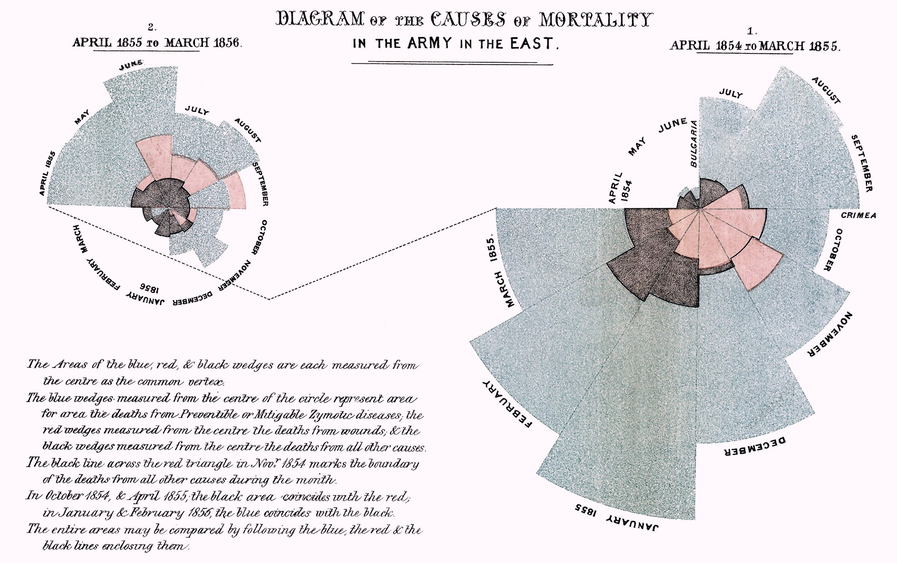
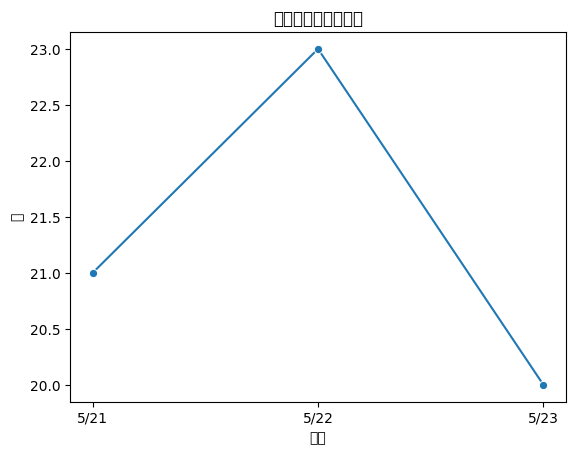

# 第8回　データの可視化

### 前回の復習

- 前処理：取得したデータを**分析しやすい形に整える**作業
- 表を結合するときは，地域や時刻など**キーとする要素が一致しているか**を確認する
- 結合によって発生する空欄は，必ずしもデータの誤りではない
- データ観察はNotebookで行い，再実行する本処理はPythonファイルとして保存する

第6回・第7回で行った前処理

| 作業 | 何をしたか | 何のためにしたか |
| --- | --- | --- |
| JSONの構造確認 | `timeSeries`ごとに地域名，地域コード，時刻，値の入り方を確認した | どの部分が天気表・降水確率表・気温表に対応するかを理解するため |
| 表形式への変換 | JSONから必要な値を取り出し，CSVとして保存した | 後で読み込みやすく，表として扱いやすい形にするため |
| 型変換 | 文字列として入っていた値を，必要に応じて数値や日付として扱えるようにした | 集計や可視化で計算できるようにするため |
| 欠損値の確認 | 空欄や値が入っていない行を確認した | データの誤りなのか，予報時刻の違いによる自然な空欄なのかを判断するため |
| 表の結合 | `地域コード`と`予報時刻`をキーにして，天気表と降水確率表を結合した | 複数の表に分かれている情報を，分析しやすい1つの表にまとめるため |
| 日付・時刻の分割 | `予報時刻`から`予報日`と`予報時`を取り出した | 日付別・時間帯別に集計しやすくするため |
| カテゴリ化 | 天気を「晴れ」「くもり」「雨」「雪」「その他」などにまとめた | 細かすぎる値を，分析や説明に使いやすい分類へ変換するため |
| Pythonファイル化 | Notebookで確認した処理を`src/*.py`として保存した | 同じ処理を再実行できるようにし，Gitで管理するため |

### シラバス変更

第9回以降の内容を次のように変更する．
統計や回帰分析は統計数学・応用統計数学で学ぶ内容と重なるため，本講義ではプログラミングによる**オープンデータの取得・前処理・可視化**を重点的に扱う．

| 回 | 変更前 | 変更後 | 変更後に扱うこと |
| --- | --- | --- | --- |
| 第9回 | 統計的理解 | 可視化II | 位置情報を含むデータを地図上に表示し，地域的な傾向を探る |
| 第10回 | データ分析I：回帰 | データ分析実践I：行政統計 | 行政統計を使って，テーマ設定，データ取得，前処理，可視化までを行う |
| 第11回 | データ分析II：分類 | データ分析実践II：経済データ | 経済データを使って，時系列や比較の観点から可視化する |
| 第12回 | データ分析演習 | データ分析実践III：スポーツデータ | スポーツデータを使って，目的に応じた集計と可視化を行う |
| 第13回 | 演習レビュー | 休講：レポート作成 | 各自で最終レポートを作成する |

- 第10回〜第12回：気象データ以外の題材を用いてデータ分析の実践例を扱う．特に「データ取得 → 前処理 → 可視化」の一連の分析を行う．
- 最終レポート：各自でデータを選び，「データ取得 → 前処理 → 可視化」の流れを一気通貫で実施する．

### 到達目標

第5回に取得した天気予報データのJSONに含まれる**週間予報**を使い，可視化しやすいデータを作成して図を作成する．
なお，今回は前処理と集計をまとめて実行するPythonスクリプトを使い，集計用データセットの作成を半自動で行う．

**可視化**：データの傾向を知るために，色々な切り口からデータを眺める手法

- データ分析の一連の流れの中で，可視化を適切に使う方法を学ぶ．
- データの傾向を知るために，複数の切り口から図を作成できる
- ヒストグラム，散布図，折れ線グラフ，棒グラフの役割を理解できる
- Pythonの `matplotlib`や`seaborn` を使って図を作成できる

### 準備

今回は第5回で作成したフォルダ`5`内で作業を続ける．

第5回で取得した次のファイルを使う．

```text
5/data/raw/jma_tokyo_forecast.json
```

これがない場合は次のリンクからダウンロードしてrawフォルダに配置すること．

[jma_tokyo_forecast_json.zip](./analysis/5/data/raw/jma_tokyo_forecast_json.zip)

また，今回は週間予報の前処理と集計をまとめて実行するPythonファイルを使う．

````{note} 演習0：作業フォルダと配布スクリプトを確認する

1. 第5回で作成した`/User/<ユーザ名>/applied_programming_i/5`を開く．
2. 次のディレクトリ構成になっているか確認する．

```text
5/
├── notebooks/
│   ├── preprocessing1.ipynb
│   ├── preprocessing2.ipynb
│   └── visualization.ipynb（←今回作成するファイル）
├── data/
│   ├── raw/
│   │   └── jma_tokyo_forecast.json
│   └── processed/
├── reports/
│   └── figures/
├── src/
│   └── build_weekly_forecast_tables.py
└── README.md
```

3. 次のファイルをダウンロード・解凍し，srcフォルダに配置する．
[build_weekly_forecast_tables_py.zip](./analysis/5/src/build_weekly_forecast_tables_py.zip)
4. JupyterLabまたはVS Codeで`notebooks/visualization.ipynb`を新規作成する．
5. `README.md`に次の内容を追記する．

```markdown
## 第8回 可視化記録

- 元データ：data/raw/jma_tokyo_forecast.json
- 出典：気象庁ホームページ
- URL：https://www.jma.go.jp/bosai/forecast/data/forecast/130000.json
- 観察用ノートブック：notebooks/visualization.ipynb（Gitでは管理しない）
- 週間予報の前処理・集計スクリプト：src/build_weekly_forecast_tables.py
- 可視化スクリプト：
  - src/plot_weekly_pop.py
  - src/plot_weekly_temperature.py
  - src/write_visualization_comment.py
- 週間予報データ・集計データ：
  - data/processed/jma_tokyo_weekly_weather.csv
  - data/processed/jma_tokyo_weekly_temperature.csv
  - data/processed/jma_tokyo_weekly_weather_summary.csv
  - data/processed/jma_tokyo_weekly_temperature_summary.csv
- 出力した図：
  - reports/figures/weekly_pop_by_area.png
  - reports/figures/weekly_temperature_tokyo.png
- 可視化の目的：
  - 地域別に週間の降水確率の変化を確認する
  - 東京の最低気温と最高気温の変化を確認する
```

6. `.gitignore`に次の記述があることを確認する．

```gitignore
# Jupyter Notebook
.ipynb_checkpoints
*.ipynb
```
````

---

## データ分析の流れと可視化

データ分析の流れ

```text
データ取得 → 前処理 → 集計 → 可視化 → 分析 → 報告
```

- 可視化：分析の途中でデータを眺め，前処理や集計が正しくできているかを確認するためにも使う．
- 様々な可視化手法を身につけることで，データを眺める切り口を変えながらデータの傾向を探る．

| 切り口 | 確認できること | 図の例 |
| --- | --- | --- |
| 値の分布を見る | 値がどの範囲に多いか，外れた値があるか | ヒストグラム |
| 2つの値の関係を見る | 一方が大きいとき，もう一方も大きいか | 散布図 |
| 時間変化を見る | 日付や時刻に沿って値がどう変わるか | 折れ線グラフ |
| グループを比較する | 地域や地点によって違いがあるか | 棒グラフ，色分けした図 |

### データの準備

配布スクリプト`src/build_weekly_forecast_tables.py`を用いて，週間予報JSONを可視化しやすい表と集計表に変換する．

本講義で使う天気予報データ`jma_tokyo_forecast.json`は次の構造になっている．

```text
data
├── data[0]：短期予報
│   ├── timeSeries[0]：天気，風，波
│   ├── timeSeries[1]：降水確率
│   └── timeSeries[2]：気温
└── data[1]：週間予報
    ├── timeSeries[0]：週間の天気，降水確率，信頼度
    └── timeSeries[1]：週間の最低気温・最高気温
```

今回は，`data[1]` の週間予報を使う．

````{note} 演習1：週間予報のCSVを作成する
ターミナルで`5`フォルダに移動し，次のコマンドを実行せよ．

```bash
python src/build_weekly_forecast_tables.py
```

実行後，次のファイルが作成されたことを確認せよ．

```text
data/processed/jma_tokyo_weekly_weather.csv
data/processed/jma_tokyo_weekly_temperature.csv
data/processed/jma_tokyo_weekly_weather_summary.csv
data/processed/jma_tokyo_weekly_temperature_summary.csv
```

それぞれの役割は次の通りである．

| ファイル | 内容 |
| --- | --- |
| `jma_tokyo_weekly_weather.csv` | 地域別・日付別の天気コード，降水確率，信頼度 |
| `jma_tokyo_weekly_temperature.csv` | 地点別・日付別の最低気温，最高気温，予報幅 |
| `jma_tokyo_weekly_weather_summary.csv` | 地域別の降水確率と信頼度の集計 |
| `jma_tokyo_weekly_temperature_summary.csv` | 地点別の最低気温・最高気温の集計 |
````

スクリプトの動作の概要

| 手順 | スクリプトが行うこと | 作成・利用するデータ |
| --- | --- | --- |
| 1 | `data/raw/jma_tokyo_forecast.json`を読み込む | 第5回で取得した気象庁の予報JSON |
| 2 | JSONの`data[1]`から週間予報を取り出す | 週間の天気・降水確率・信頼度，週間の気温 |
| 3 | 地域別・日付別の天気表を作る | `data/processed/jma_tokyo_weekly_weather.csv` |
| 4 | 地点別・日付別の気温表を作る | `data/processed/jma_tokyo_weekly_temperature.csv` |
| 5 | 地域別に降水確率と信頼度を集計する | `data/processed/jma_tokyo_weekly_weather_summary.csv` |
| 6 | 地点別に最低気温・最高気温を集計する | `data/processed/jma_tokyo_weekly_temperature_summary.csv` |

配布スクリプトは「JSONから必要な値を取り出す」「空欄を確認しやすい形にする」「日付別・地域別・地点別に眺められる表を作る」という前処理をまとめて実行している．

```text
data/raw/jma_tokyo_forecast.json
  ↓
  ↓ src/build_weekly_forecast_tables.py
  ↓
data/processed/jma_tokyo_weekly_weather.csv
data/processed/jma_tokyo_weekly_temperature.csv
data/processed/jma_tokyo_weekly_weather_summary.csv
data/processed/jma_tokyo_weekly_temperature_summary.csv
```

### データ可視化の歴史

データ可視化の歴史は1700年代に遡る．

- 1700年代後半：折れ線グラフ・棒グラフなどのチャートが作られる．
- 1800年代：複数の情報を一目でわかるような工夫がなされるようになる．（例：ナイチンゲールの鶏頭図）
- 1900年代：コンピュータの出現によりデータ可視化手法が急速に発展する．



Yuichi Yazaki「ナイチンゲールによる「鶏冠」チャート」2020.8.14. URL:https://visualizing.jp/nightingale-chart/ （2026年6月9日閲覧）より

クリミア戦争におけるイギリス軍兵士の各月の死亡数を死因別に可視化したグラフ．
- 円状に各月の死亡数を配置
- 赤：戦闘での死亡数
- 黒：その他の死亡数
- 青：伝染病による死亡数

ナイチンゲールはこのグラフから，伝染病の予防に力を入れるべきことをイギリス政府に提案し，兵士の死亡数の改善を実現した．

### データ可視化の役割

データ可視化の果たす役割として，以下の3つの機能が挙げられる．

1. **概観**：データの全体像を把握する
2. **発見**：データの特徴や新しい事象を見つける手助けをする
3. **伝達**：データの読み手に1・2を伝える

この役割を果たすにあたり，次の手順で可視化を行う

1. データの着目点を考える
2. データの収集・処理を行う
3. 着目点に応じて適切な可視化を行う

---

## 使用するデータ

### 週間天気データ

```text
data/processed/jma_tokyo_weekly_weather.csv
```

主な列：

- `地域名`
- `地域コード`
- `予報時刻`
- `予報日`
- `天気コード`
- `降水確率`
- `信頼度`

このデータでは，地域ごとの降水確率の時間変化を可視化する．

Notebookでは，ファイル名や列名だけでなく，実際に表の先頭行を確認する．
`pandas`でCSVを読み込み，`head()`でデータの中身を眺める．

```python
import pandas as pd

weekly_weather_path = "../data/processed/jma_tokyo_weekly_weather.csv"
weekly_weather_df = pd.read_csv(weekly_weather_path)

weekly_weather_df.head()
```

### 週間気温データ

```text
data/processed/jma_tokyo_weekly_temperature.csv
```

主な列：

- `地点名`
- `地点コード`
- `予報時刻`
- `予報日`
- `最低気温`
- `最高気温`
- `最低気温上限`
- `最低気温下限`
- `最高気温上限`
- `最高気温下限`

このデータでは，地点ごとの最低気温・最高気温の時間変化を可視化する．

週間気温データについても，`head()`で先頭行を確認する．

```python
weekly_temperature_path = "../data/processed/jma_tokyo_weekly_temperature.csv"
weekly_temperature_df = pd.read_csv(weekly_temperature_path)

weekly_temperature_df.head()
```

```{tip} 注意
週間天気データの `地域名` は「東京地方」「伊豆諸島」「小笠原諸島」である．
週間気温データの `地点名` は「東京」「八丈島」「父島」である．
地域と地点は単位が異なるため，今回は別々の図として扱う．
```

---

## 可視化の準備

Pythonで可視化を行うときは，目的に応じてライブラリを使い分ける．
第8回では，次のライブラリを使う．

| ライブラリ | 主な役割 | この回での使い方 |
| --- | --- | --- |
| `pandas` | 表形式データの読み込み，確認，前処理，集計 | CSVを読み込み，欠損値や列を確認し，図に使う表を作る |
| `seaborn` | 分布，比較，関係を少ないコードで可視化 | ヒストグラム，散布図，折れ線グラフ，棒グラフを作る |
| `matplotlib` | 図の細かい調整と保存 | タイトル，軸ラベル，サイズ，保存先を指定する |
| `janome` | 日本語テキストの分かち書き | 天気や風の説明文を単語に分け，出現回数を見る |

````{note} 演習2：可視化に使うライブラリを確認する
`notebooks/visualization.ipynb`に「可視化の準備」という見出しを作り，次のセルを順番に実行し，各ライブラリの使い方を確認せよ．

**セル1：作業中のディレクトリを確認する**

```bash
!pwd
```

**セル2：必要なライブラリをインストールする**

初回のみ，次のセルを実行して必要なライブラリをインストールする．
すでにインストール済みの場合はすぐに終了する．

※ notebookで起動しているpythonに確実にインストールするために実施する．

```bash
!python -m pip install pandas seaborn matplotlib janome
```

**セル3：ライブラリを読み込む**

グラフに日本語を表示するためにmac標準フォント"Hiragino Sans"を指定する．

```python
import matplotlib.pyplot as plt
import pandas as pd
import seaborn as sns
from janome.tokenizer import Tokenizer

plt.rcParams["font.family"] = "Hiragino Sans"
sns.set_theme(style="whitegrid", font="Hiragino Sans")
```

**セル4：pandasとseabornで簡単な図を作る**

sample_df の「日付」を横軸「値」を縦軸にして各点に丸印を付けた折れ線グラフを ax という描画領域に描く．

- `sns.lineplot()`：seabornで折れ線グラフを表示する

```python
sample_df = pd.DataFrame({
    "日付": ["5/21", "5/22", "5/23"],
    "値": [21, 23, 20]
})

fig, ax = plt.subplots()

sns.lineplot(data=sample_df, x="日付", y="値", marker="o", ax=ax)

ax.set_title("折れ線グラフの確認")
ax.set_xlabel("日付")
ax.set_ylabel("値")

plt.show()
```

**セル5：janomeで日本語を単語に分ける**

- `tokenizer.tokenize(text)`：`text`の文字列を**形態素解析**する．

```python
tokenizer = Tokenizer()
text = "くもり 時々 晴れ 夜遅く 雨"

for token in tokenizer.tokenize(text):
    print(token)
```

- `.surface`：形態素解析で分解された元の文字列を出力する．

```python
words = [token.surface for token in tokenizer.tokenize(text)]

words
```

実行後，次を確認せよ．

1. 図が表示されたか
2. 日本語のタイトルや軸ラベルが表示されたか
3. `sample_df` の表から図が作成されているか
4. `janome` で日本語が単語に分かれているか
5. 日本語が文字化けした場合，どのように見えるか
````

```{tip} 日本語の文字化け
日本語のフォント設定がうまくされていないと，次の画像のように日本語が正しく表示されないことがある．
文字化けしたときに表示される白い四角を ".notdef" (Not Defined) グリフと呼び，その見た目から通称 "tofu" や "豆腐文字" と呼ぶ．



<!-- https://zenn.dev/gapul/articles/2459a351b134f7 -->
```

### 図を作る前にデータを確認する

図を作る前に行数・列名・値の例を確認する．
データの形を確認しないまま図を作ると，意図しない列を使ったり空欄を含んだまま計算したりする可能性がある．

````{note} 演習3：可視化に使うデータを確認する
`notebooks/visualization.ipynb`に「可視化に使うデータを確認する」という見出しを作り，次のセルを順番に実行せよ．

**セル1：CSVを読み込む**

```python
weekly_weather_path = "../data/processed/jma_tokyo_weekly_weather.csv"
weekly_temperature_path = "../data/processed/jma_tokyo_weekly_temperature.csv"

weekly_weather_df = pd.read_csv(weekly_weather_path)
weekly_temperature_df = pd.read_csv(weekly_temperature_path)
```

**セル2：行数と列名を確認する**

```python
print("週間天気データの行数・列数:", weekly_weather_df.shape)
print("週間天気データの列名:", list(weekly_weather_df.columns))
print()
print("週間気温データの行数・列数:", weekly_temperature_df.shape)
print("週間気温データの列名:", list(weekly_temperature_df.columns))
```

**セル3：表として先頭行を確認する**

```python
weekly_weather_df.head()
```

```python
weekly_temperature_df.head()
```

**セル4：空欄の数を確認する**

- `.isna()`：指定の列で空欄になっている行をTrue，それ以外をFalseとする．
- `.sum()`：Trueの数を数え上げる．

```python
weather_missing_pop = weekly_weather_df["降水確率"].isna().sum()
temperature_missing = (
    weekly_temperature_df["最低気温"].isna()
    | weekly_temperature_df["最高気温"].isna()
).sum()

print("降水確率が空欄の行数:", weather_missing_pop)
print("最低気温または最高気温が空欄の行数:", temperature_missing)
```

**セル5：数値列の概要を確認する**

- `.describe()`：簡単な統計データを出力する．

| 行       | 意味     |
| ------- | ------ |
| `count` | データの個数 |
| `mean`  | 平均値    |
| `std`   | 標準偏差   |
| `min`   | 最小値    |
| `25%`   | 第1四分位数 |
| `50%`   | 中央値    |
| `75%`   | 第3四分位数 |
| `max`   | 最大値    |

```python
weekly_weather_df[["降水確率"]].describe()
```

```python
weekly_temperature_df[["最低気温", "最高気温"]].describe()
```

実行後，次を確認せよ．

1. 週間天気データにはどのような列があるか
2. 週間気温データにはどのような列があるか
3. `pandas`では空欄がどのように表示されているか
4. 空欄の行はあるか
5. `降水確率`，`最低気温`，`最高気温` はどの範囲の値を取っているか
````

### 日本語テキストを眺める

数値データだけでなく，日本語の説明文も可視化の対象になる．
ただし，日本語の文章は英語のように単語の間に空白が入っているとは限らないため，単語に分ける処理が問題になる．
このようなときに`janome`を使う．

ここでは第6回で作成した`data/processed/jma_tokyo_weather_clean.csv`の`天気`列を使い，天気の説明に出てくる単語の回数を確認する．

````{note} 演習4：janomeで天気の説明を単語に分けて可視化する
`notebooks/visualization.ipynb`に「日本語テキストを眺める」という見出しを作り，次のセルを順番に実行せよ．

**セル1：第6回で作成した天気表を読み込む**

```python
weather_text_path = "../data/processed/jma_tokyo_weather_clean.csv"

weather_text_df = pd.read_csv(weather_text_path)
weather_text_df[["地域名", "予報日", "天気"]].head()
```

`jma_tokyo_weather_clean.csv`が手元にない場合は，次のリンクからダウンロードして`data/processed`に配置すること．

[jma_tokyo_weather_clean_csv.zip](./analysis/5/data/processed/jma_tokyo_weather_clean_csv.zip)

**セル2：天気の説明を単語に分ける**

- `Counter`：リストの中にある要素の出現回数を数えるモジュール

```python
from collections import Counter

tokenizer = Tokenizer()
words = []

for text in weather_text_df["天気"].dropna().astype(str):
    for token in tokenizer.tokenize(text):
        part = token.part_of_speech.split(",")[0]
        if part in {"名詞", "動詞", "形容詞"}:
            # 名詞・動詞・形容詞に分類される文字列だけ`words`に追加する
            words.append(token.surface)

word_counts_df = pd.DataFrame(
    Counter(words).most_common(10),
    columns=["単語", "出現回数"]
)

word_counts_df
```

**セル3：出現回数を棒グラフにする**

- `sns.barplot()`：seabornで棒グラフを表示する

```python
fig, ax = plt.subplots(figsize=(7, 5))

sns.barplot(
    data=word_counts_df,
    x="出現回数",
    y="単語",
    ax=ax
)

ax.set_title("天気の説明に出てくる単語")
ax.set_xlabel("出現回数")
ax.set_ylabel("単語")

plt.tight_layout()
plt.show()
```

実行後，次を確認せよ．

1. 天気の説明にはどのような単語が多く出ているか
````

---

## 可視化の実施

### 週間の降水確率

週間予報では複数の日付に対して降水確率が入っている．
時間に沿った変化を見るために**折れ線グラフ**で可視化する．

折れ線グラフが有効な場合

- 時間に沿った変化を見る
- 日付ごとの増減を確認する
- 複数の地域や地点の変化を比較する

````{note} 演習5：地域別の降水確率を折れ線グラフにする
`notebooks/visualization.ipynb`に「週間の降水確率を可視化する」という見出しを作り，次のセルを順番に実行せよ．

**セル1：図に使うデータを作る**

- 降水確率の欠損値がない行だけ取り出した DataFrame を作成する．
- 年の表示は必要ないので月日だけ取得する．(`2026-05-24` → `05-24`)
- 図に使う「地域名」「予報日表示」「降水確率」のデータの中身を最終確認する．

```python
weekly_weather_plot_df = weekly_weather_df.dropna(subset=["降水確率"]).copy()
weekly_weather_plot_df["予報日表示"] = weekly_weather_plot_df["予報日"].str[5:]

weekly_weather_plot_df[["地域名", "予報日表示", "降水確率"]].head()
```

**セル2：seabornで折れ線グラフを作成する**

- `hue="地域名"`：地域名ごとにプロットを作成する．

```python
fig, ax = plt.subplots(figsize=(8, 5))

sns.lineplot(
    data=weekly_weather_plot_df,
    x="予報日表示",
    y="降水確率",
    hue="地域名",
    marker="o",
    ax=ax
)

ax.set_title("週間予報の降水確率")
ax.set_xlabel("予報日")
ax.set_ylabel("降水確率（%）")
ax.set_ylim(0, 100)

plt.tight_layout()
plt.show()
```

実行後，次を確認せよ．

1. 地域ごとに線が表示されているか
2. 縦軸は0から100になっているか
3. どの日に降水確率が高いか
4. 地域ごとの違いはあるか
````

````{warning} 課題1：地域別の平均降水確率をPythonファイルで可視化する
演習5で確認した内容を応用する．
以下のコードの`<HOGEHOGE1>`〜`<HOGEHOGE3>`を適切に書き換えて`src/plot_weekly_pop.py`を作成し，コードを実行して`report/figures/weekly_pop_by_area.png`を作成せよ．  
最後に，作成した`src/plot_weekly_pop.py`と`report/figures/weekly_pop_by_area.png`を<span style="color:red">WebClass「第8回課題」問1・問2</span>から提出せよ．

```{tip} ポイント
いきなりpythonファイルを作成するのではなく，notebookで試験的にコードを実行し，うまくコードが走るようになってからpythonコードにコピーして実施すると書きやすい．
```

演習5では地域別に日付ごとの降水確率を折れ線グラフで表示したが，本課題では**地域別の平均降水確率**を棒グラフで表示する．

```python
from pathlib import Path

import matplotlib.pyplot as plt
import pandas as pd
import seaborn as sns

input_path = "data/processed/jma_tokyo_weekly_weather.csv"
output_path = "reports/figures/weekly_pop_by_area.png"

plt.rcParams["font.family"] = "Hiragino Sans"
sns.set_theme(style="whitegrid", font="Hiragino Sans")
Path("reports/figures").mkdir(parents=True, exist_ok=True)

weekly_weather_df = pd.read_csv(input_path)
weekly_weather_plot_df = weekly_weather_df.dropna(subset=["降水確率"]).copy()

summary_rows = []

for area in weekly_weather_plot_df["地域名"].unique():
    area_df = weekly_weather_plot_df[weekly_weather_plot_df["地域名"] == area]
    pop_description = area_df["降水確率"].describe()

    summary_rows.append({
        "地域名": <HOGEHOGE1>,
        "平均降水確率": <HOGEHOGE2>,
        "最大降水確率": <HOGEHOGE3>,
        "データ数": int(pop_description["count"])
    })

pop_summary_df = pd.DataFrame(summary_rows)

print(pop_summary_df)

fig, ax = plt.subplots(figsize=(7, 5))

sns.barplot(
    data=pop_summary_df,
    x="平均降水確率",
    y="地域名",
    ax=ax
)

ax.set_title("地域別の平均降水確率")
ax.set_xlabel("平均降水確率（%）")
ax.set_ylabel("地域")
ax.set_xlim(0, 100)

plt.tight_layout()
plt.savefig(output_path, dpi=150)

print("saved:", output_path)
```

作成したPythonファイルを`5`フォルダ内でターミナルから実行せよ．

```bash
python src/plot_weekly_pop.py
```

実行後，`reports/figures/weekly_pop_by_area.png`が作成されていることを確認せよ．
````
<!-- 
````{dropdown} 解答例
```python
from pathlib import Path

import matplotlib.pyplot as plt
import pandas as pd
import seaborn as sns

input_path = "data/processed/jma_tokyo_weekly_weather.csv"
output_path = "reports/figures/weekly_pop_by_area.png"

plt.rcParams["font.family"] = "Hiragino Sans"
sns.set_theme(style="whitegrid", font="Hiragino Sans")
Path("reports/figures").mkdir(parents=True, exist_ok=True)

weekly_weather_df = pd.read_csv(input_path)
weekly_weather_plot_df = weekly_weather_df.dropna(subset=["降水確率"]).copy()

summary_rows = []

for area in weekly_weather_plot_df["地域名"].unique():
    area_df = weekly_weather_plot_df[weekly_weather_plot_df["地域名"] == area]
    pop_description = area_df["降水確率"].describe()

    summary_rows.append({
        "地域名": area,
        "平均降水確率": round(pop_description["mean"], 1),
        "最大降水確率": pop_description["max"],
        "データ数": int(pop_description["count"])
    })

pop_summary_df = pd.DataFrame(summary_rows)
pop_summary_df = pop_summary_df.sort_values("平均降水確率", ascending=False)

print(pop_summary_df)

fig, ax = plt.subplots(figsize=(7, 5))

sns.barplot(
    data=pop_summary_df,
    x="平均降水確率",
    y="地域名",
    ax=ax
)

ax.set_title("地域別の平均降水確率")
ax.set_xlabel("平均降水確率（%）")
ax.set_ylabel("地域")
ax.set_xlim(0, 100)

plt.tight_layout()
plt.savefig(output_path, dpi=150)

print("saved:", output_path)
```
````
 -->

### 週間の気温

週間気温データから東京の最低気温と最高気温を可視化する．
気温は日付に沿って変化する値であるため**折れ線グラフ**を使う．

````{note} 演習6：東京の最低気温と最高気温を折れ線グラフにする
`notebooks/visualization.ipynb`に「週間の気温を可視化する」という見出しを作り，次のセルを順番に実行せよ．

**セル1：東京の気温データを取り出す**

```python
target_point = "東京"

tokyo_temperature_df = (
    weekly_temperature_df[weekly_temperature_df["地点名"] == target_point]
    .dropna(subset=["最低気温", "最高気温"])
    .copy()
)

tokyo_temperature_df["予報日表示"] = tokyo_temperature_df["予報日"].str[5:]

tokyo_temperature_long_df = tokyo_temperature_df.melt(
    id_vars=["予報日表示"],
    value_vars=["最高気温", "最低気温"],
    var_name="種類",
    value_name="気温"
)

tokyo_temperature_long_df.head()
```

**セル2：seabornで折れ線グラフを作成する**

```python
fig, ax = plt.subplots(figsize=(8, 5))

sns.lineplot(
    data=tokyo_temperature_long_df,
    x="予報日表示",
    y="気温",
    hue="種類",
    marker="o",
    ax=ax
)

ax.set_title("東京の週間気温予報")
ax.set_xlabel("予報日")
ax.set_ylabel("気温（℃）")

plt.tight_layout()
plt.show()
```

実行後，次を確認せよ．

1. 最高気温と最低気温が別の線として表示されているか
2. どの日の最高気温が高いか
3. 最高気温と最低気温の差が大きい日はいつか
````

````{warning} 課題2：週間の気温をPythonファイルで可視化する
1. 演習6で確認した内容をもとに，`src/plot_weekly_temperature.py`を作成し，
WebClass「第8回課題」問2から提出せよ．

提出するのはPythonファイルのみである．作成されるCSVファイルやPNGファイルは提出しなくてよい．

次のコードの `<FUGAFUGA>` と `<HOGEHOGE>` を適切に置き換え，`reports/figures/weekly_temperature_tokyo.png`を作成すること．

ただし，演習6の図に加えて，次の条件を満たすこと．

1. 東京のデータだけを取り出す
2. `最低気温` または `最高気温` が欠損している行を除外する
3. `気温差` 列を作成する
4. 1つ目の図に最高気温・最低気温の折れ線グラフを描く
5. 2つ目の図に日ごとの `気温差` を棒グラフで描く

```python
from pathlib import Path

import matplotlib.pyplot as plt
import pandas as pd
import seaborn as sns

input_path = "data/processed/jma_tokyo_weekly_temperature.csv"
output_path = "reports/figures/weekly_temperature_tokyo.png"

plt.rcParams["font.family"] = "Hiragino Sans"
sns.set_theme(style="whitegrid", font="Hiragino Sans")
Path("reports/figures").mkdir(parents=True, exist_ok=True)

weekly_temperature_df = pd.read_csv(input_path)

target_point = "東京"

<FUGAFUGA>

fig, axes = plt.subplots(2, 1, figsize=(8, 8), sharex=True)

sns.lineplot(
    data=tokyo_temperature_long_df,
    x="予報日表示",
    y="気温",
    hue="種類",
    marker="o",
    ax=axes[0]
)

axes[0].set_title("東京の週間気温予報")
axes[0].set_xlabel("")
axes[0].set_ylabel("気温（℃）")

sns.barplot(
    data=tokyo_temperature_df,
    x="予報日表示",
    y="気温差",
    color="lightgray",
    ax=axes[1]
)

axes[1].set_title("最高気温と最低気温の差")
axes[1].set_xlabel("予報日")
axes[1].set_ylabel("気温差（℃）")

plt.tight_layout()
<HOGEHOGE>

print("saved:", output_path)
```

作成したPythonファイルを`5`フォルダ内でターミナルから実行せよ．

```bash
python src/plot_weekly_temperature.py
```

実行後，`reports/figures/weekly_temperature_tokyo.png`が作成されていることを確認せよ．
````

<!--
tokyo_temperature_df = (
    weekly_temperature_df[weekly_temperature_df["地点名"] == target_point]
    .dropna(subset=["最低気温", "最高気温"])
    .copy()
)

tokyo_temperature_df["予報日表示"] = tokyo_temperature_df["予報日"].str[5:]
tokyo_temperature_df["気温差"] = tokyo_temperature_df["最高気温"] - tokyo_temperature_df["最低気温"]

tokyo_temperature_long_df = tokyo_temperature_df.melt(
    id_vars=["予報日表示"],
    value_vars=["最高気温", "最低気温"],
    var_name="種類",
    value_name="気温"
)

plt.savefig(output_path, dpi=150)
-->

同じデータでも，図の種類を変えると見えることが変わる．
ここでは，降水確率を「分布」と「関係」の切り口から眺める．

````{note} 演習7：ヒストグラムと散布図で別の切り口から眺める
`notebooks/visualization.ipynb`に「別の切り口から眺める」という見出しを作り，次のセルを順番に実行せよ．

**セル1：降水確率の分布をヒストグラムで見る**

```python
fig, ax = plt.subplots(figsize=(7, 5))

sns.histplot(
    data=weekly_weather_plot_df,
    x="降水確率",
    bins=6,
    hue="地域名",
    multiple="dodge",
    ax=ax
)

ax.set_title("降水確率の分布")
ax.set_xlabel("降水確率（%）")
ax.set_ylabel("件数")

plt.tight_layout()
plt.show()
```

**セル2：最低気温と最高気温の関係を散布図で見る**

```python
temperature_scatter_df = weekly_temperature_df.dropna(subset=["最低気温", "最高気温"])

fig, ax = plt.subplots(figsize=(6, 5))

sns.scatterplot(
    data=temperature_scatter_df,
    x="最低気温",
    y="最高気温",
    hue="地点名",
    s=80,
    ax=ax
)

ax.set_title("最低気温と最高気温の関係")
ax.set_xlabel("最低気温（℃）")
ax.set_ylabel("最高気温（℃）")

plt.tight_layout()
plt.show()
```

実行後，次を確認せよ．

1. 折れ線グラフとヒストグラムでは，見えてくることがどのように違うか
2. 散布図から，最低気温と最高気温の関係を読み取れるか
3. どの図が，どの問いに向いているか
````

---

## まとめ

- 可視化は，データの傾向を知るために，色々な切り口からデータを眺めるための工程である
- 図を作る前には，行数，列名，値の例，空欄の有無を確認する
- 表の確認と集計には`pandas`，日本語テキストには`janome`，分布や比較の図には`seaborn`，図の調整と保存には`matplotlib`を使う
- 集計用データセットを作ると，地域別・地点別の特徴を確認しやすくなる
- 時間に沿った変化を見るときは，折れ線グラフが使いやすい
- 図には，タイトル，軸ラベル，単位，凡例を適切に設定する
- 空欄を除外した場合は，その処理を説明できるようにする
- 図から読み取れることと，読み取れないことを分けて文章にする
- データ観察はNotebookで行い，再実行する本処理はPythonファイルとして保存する

次回は地図上への可視化を扱う．

- 位置情報を含むデータを地図上に表示し，地域ごとの傾向を探る方法を学ぶ
- 第10回以降は，気象以外のデータを使った分析実践例を扱う
- 図と数値を組み合わせて，データの特徴を説明する

### 課題の提出期限

6月9日(火)23:59まで

---

## 自主学習用の発展問題

課題を全てこなし時間が余った場合に取り組んでください．
WebClassの提出場所から提出したものについて加点対象とします．

````{note} 課題4：気温の予報幅を可視化する

`jma_tokyo_weekly_temperature.csv`には，最低気温・最高気温だけでなく，予報の上限・下限も含まれている．
東京の最高気温について，予報値と予報幅を同じ図に表示せよ．

`src/plot_weekly_temperature_range.py`を作成し，WebClass「第8回課題」問4から提出せよ．

提出するのは作成したPythonファイルのみである．作成されるPNGファイルは提出しなくてよい．

実行後，次の点を確認し，必要に応じてPythonファイル内のコメントに残すこと．

1. 予報幅が広い日はいつか
2. 予報幅が広いことは，どのような意味を持つと考えられるか
3. 折れ線だけの図と比べて，情報は増えたか
````

<!--
````{dropdown} 解答例
最高気温の予報値を折れ線で示し，上限と下限の範囲を薄い帯として表示する例である．

```python
from pathlib import Path

import matplotlib.pyplot as plt
import pandas as pd

input_path = "data/processed/jma_tokyo_weekly_temperature.csv"
output_path = "reports/figures/weekly_temperature_range_tokyo.png"

plt.rcParams["font.family"] = "Hiragino Sans"
Path("reports/figures").mkdir(parents=True, exist_ok=True)

temperature_df = pd.read_csv(input_path)

tokyo_df = (
    temperature_df[temperature_df["地点名"] == "東京"]
    .dropna(subset=["最高気温", "最高気温下限", "最高気温上限"])
    .copy()
)

tokyo_df["予報日表示"] = tokyo_df["予報日"].str[5:]
x = list(range(len(tokyo_df)))

fig, ax = plt.subplots(figsize=(8, 5))

ax.plot(x, tokyo_df["最高気温"], marker="o", label="最高気温")
ax.fill_between(
    x,
    tokyo_df["最高気温下限"],
    tokyo_df["最高気温上限"],
    alpha=0.2,
    label="最高気温の予報幅"
)

ax.set_title("東京の最高気温予報と予報幅")
ax.set_xlabel("予報日")
ax.set_ylabel("気温（℃）")
ax.set_xticks(x)
ax.set_xticklabels(tokyo_df["予報日表示"])
ax.legend()

plt.tight_layout()
plt.savefig(output_path, dpi=150)

print("saved:", output_path)
```
````
-->

````{note} 課題5：信頼度ごとの平均降水確率を可視化する

`jma_tokyo_weekly_weather.csv`の `信頼度` を使い，信頼度ごとの平均降水確率を棒グラフで表示せよ．

`src/plot_weekly_pop_by_reliability.py`を作成し，WebClass「第8回課題」問5から提出せよ．

提出するのは作成したPythonファイルのみである．作成されるPNGファイルは提出しなくてよい．

実行後，次の点を確認し，必要に応じてPythonファイル内のコメントに残すこと．

1. 信頼度が空欄の行はどう扱ったか
2. 信頼度ごとのデータ数は十分か
3. 平均だけを見てよいか
````

<!--
````{dropdown} 解答例
信頼度が `A`，`B`，`C` の行だけを使い，それぞれの平均降水確率を計算して表示する例である．

```python
from pathlib import Path

import matplotlib.pyplot as plt
import pandas as pd
import seaborn as sns

input_path = "data/processed/jma_tokyo_weekly_weather.csv"
output_path = "reports/figures/weekly_pop_by_reliability.png"

plt.rcParams["font.family"] = "Hiragino Sans"
sns.set_theme(style="whitegrid", font="Hiragino Sans")
Path("reports/figures").mkdir(parents=True, exist_ok=True)

weather_df = pd.read_csv(input_path)

summary_df = (
    weather_df
    .dropna(subset=["信頼度", "降水確率"])
)

summary_df = (
    summary_df[summary_df["信頼度"].isin(["A", "B", "C"])]
    .groupby("信頼度", as_index=False)
    .agg(
        平均降水確率=("降水確率", "mean"),
        件数=("降水確率", "count")
    )
)

fig, ax = plt.subplots(figsize=(6, 4))

sns.barplot(
    data=summary_df,
    x="信頼度",
    y="平均降水確率",
    ax=ax
)

ax.set_title("信頼度ごとの平均降水確率")
ax.set_xlabel("信頼度")
ax.set_ylabel("平均降水確率（%）")
ax.set_ylim(0, 100)

plt.tight_layout()
plt.savefig(output_path, dpi=150)

print("saved:", output_path)
```
````
-->

````{note} 課題6：seabornで地点別の最高気温を可視化する

`pandas` と `seaborn` を使い，地点別の最高気温を折れ線グラフで表示せよ．

`src/plot_weekly_max_temperature_by_point_seaborn.py`を作成し，WebClass「第8回課題」問6から提出せよ．

提出するのは作成したPythonファイルのみである．作成されるPNGファイルは提出しなくてよい．

実行後，次の点を確認し，必要に応じてPythonファイル内のコメントに残すこと．

1. `pandas` と `seaborn` を使うと，データの選択やグループ分けはどう書けるか
2. `hue="地点名"` は何を表しているか
3. ライブラリを使う利点と注意点は何か
````

<!--
````{dropdown} 解答例
`pandas` でCSVを読み込み，`seaborn.lineplot`で地点別に線を分けて表示する例である．

```python
from pathlib import Path

import matplotlib.pyplot as plt
import pandas as pd
import seaborn as sns

input_path = "data/processed/jma_tokyo_weekly_temperature.csv"
output_path = "reports/figures/weekly_max_temperature_by_point_seaborn.png"

plt.rcParams["font.family"] = "Hiragino Sans"
Path("reports/figures").mkdir(parents=True, exist_ok=True)

temperature_df = pd.read_csv(input_path)
temperature_df = temperature_df.dropna(subset=["最高気温"])

fig, ax = plt.subplots(figsize=(8, 5))

sns.lineplot(
    data=temperature_df,
    x="予報日",
    y="最高気温",
    hue="地点名",
    marker="o",
    ax=ax
)

ax.set_title("地点別の週間最高気温予報")
ax.set_xlabel("予報日")
ax.set_ylabel("最高気温（℃）")

plt.xticks(rotation=20)
plt.tight_layout()
plt.savefig(output_path, dpi=150)

print("saved:", output_path)
```
````
-->
